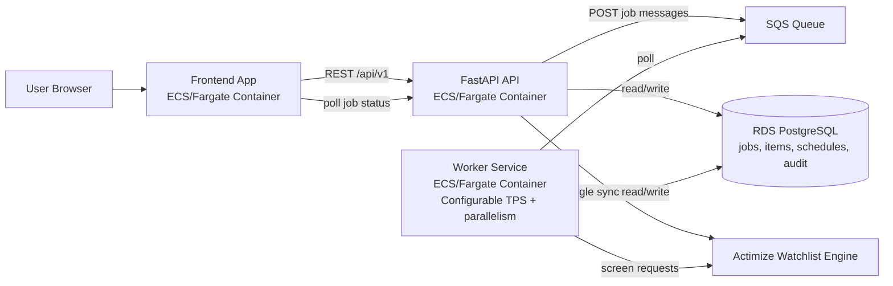
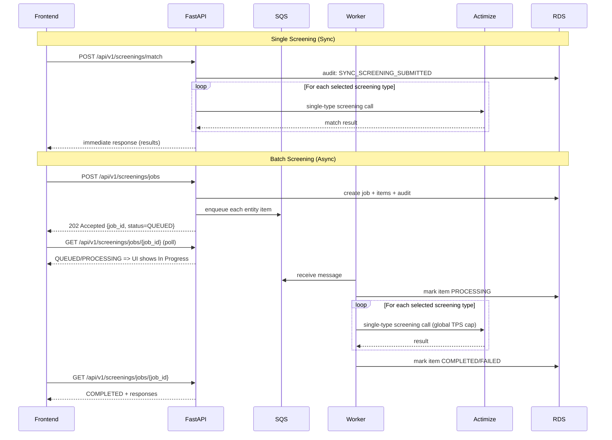
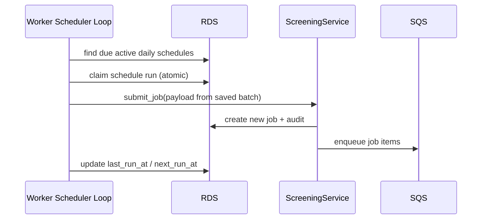

# OFAC Screening Enterprise App

This repository has been upgraded to an enterprise-style architecture:

- Frontend: React + Vite, containerized (Nginx runtime)
- Backend API: FastAPI
- Queue: AWS SQS (LocalStack in local Docker setup)
- Screening engine: Actimize Watchlist adapter (single-request model)
- Throughput control: worker-side TPS throttle plus configurable parallel message processing.

## Architecture

1. Single-screen flow: frontend calls FastAPI sync endpoint for immediate Actimize response.
2. Batch flow: frontend submits job to FastAPI; API persists job + items and enqueues one SQS message per entity.
3. Worker consumes SQS, screens each entity with Actimize (or mock mode), and enforces configurable TPS + parallelism.
4. Worker stores normalized batch results back in SQLite.
5. Frontend polls batch job status and renders results when complete.
6. Users can select one or many screening types (`Sanction`, `PEP`, `AME`, `Fincen 314(a)`, `Global Sanction`) in both single and batch modes.
7. Single screening supports `mock_screening` mode: hit-check only (no Actimize alert) or alert generation.
8. Batch supports scheduled screening with selectable frequency (`DAILY`, `WEEKLY`, `MONTHLY`).
9. Users can disable daily screening for a scheduled batch directly from Screening Results using the `Disable Daily` action.
10. Batch source files are uploaded to S3 with traceable metadata persisted in DB (file name, hash, and S3 path).
11. Scheduled batches support re-upload; future runs screen only net-new records not seen in prior runs.
12. Users can subscribe to scheduled run completion notifications and review notifications in-app.
13. Capacity assumption for this deployment: up to `80` total users with around `15` concurrent active sessions.

### Architecture Diagram



### API Flow Pattern



### Daily Screening Pattern



PDF version of these diagrams: `docs/architecture-api-flow.pdf`

## Technical Design Document

- TDD (Markdown, includes Mermaid diagrams): `docs/technical-design-document.md`
- TDD (Word-openable document): `docs/technical-design-document.doc`

## Key Paths

- Frontend API client: `src/api/screeningApi.ts`
- FastAPI app: `backend/app/main.py`
- SQS worker runtime: `worker/worker_app/worker.py`
- Actimize adapter: `backend/app/actimize.py`
- Persistence: `backend/app/repository.py`
- Local stack orchestration: `docker-compose.yml`

## Local Run (Containerized)

Initialize the database schema explicitly on a fresh environment:

```bash
docker compose run --rm backend python -m app.init_db
```

Then start the stack:

```bash
docker compose up --build
```

Endpoints:

- Frontend: `http://localhost:8080`
- Backend health: `http://localhost:8000/health`
- LocalStack (SQS): `http://localhost:4566`

## Environment Variables

Frontend (`.env`, see `.env.example`):

- `VITE_SCREENING_API_BASE_URL` default `/api/v1`
- `VITE_SCREENING_POLL_INTERVAL_MS` default `750`
- `VITE_SCREENING_JOB_TIMEOUT_MS` default `90000`
- `VITE_AUTH_ENABLED` default `true` (`false` disables OIDC and uses local admin mode)
- `VITE_OIDC_AUTHORITY` ex: `https://cognito-idp.<region>.amazonaws.com/<user_pool_id>`
- `VITE_OIDC_CLIENT_ID` ex: `<oidc_app_client_id>`
- `VITE_OIDC_REDIRECT_URI` ex: `http://localhost:8080/`
- `VITE_OIDC_POST_LOGOUT_REDIRECT_URI` ex: `http://localhost:8080/signed-out`
- `VITE_OIDC_SCOPE` ex: `openid profile email`
- `VITE_OIDC_IDLE_TIMEOUT_MS` ex: `900000` (15 minutes; set `0` to disable idle auto-logout)
- `VITE_OIDC_CLEAR_SESSION_ON_CLOSE` ex: `true` (stores OIDC session in `sessionStorage`; clears on tab/browser close)
- `VITE_ACTIMIZE_REVIEW_ALERT_URL` ex: `http://actimizeuat/` (optional; controls the `Review Alert` link in Screening Results)

Frontend runtime config in container:
- In ECS, frontend reads `VITE_*` values at container startup from environment variables (no image rebuild needed).
- Runtime values are written to `/app-config.js` by `frontend/entrypoint.sh`.

Backend/Worker (`backend/.env.example`):

- `APP_DB_URL` optional. If set to a `postgresql://...` URL, backend/worker use PostgreSQL instead of SQLite (`APP_DB_PATH`).
- In ECS, keep DB settings in one shared secret (recommended: `ofac-screening/database-config`) and reference the same `APP_DB_URL`/`APP_DB_PATH` keys from both backend and worker task definitions.
- Example payload for the shared DB secret: `deploy/ecs/database-config.example.json`.
- Backend and worker validate schema at startup, but they do not run DDL automatically. Initialize schema explicitly with `python -m app.init_db` as part of setup/deployment.
- `SCREENING_TPS=32` caps outbound screening API request rate
- `SCREENING_PARALLEL_MESSAGES=1` controls how many SQS messages the worker processes concurrently
- `SCREENING_ITEM_RETRY_MAX_ATTEMPTS=2` retries transient upstream failures before marking an item failed
- `SCREENING_ITEM_RETRY_INITIAL_DELAY_S=3` base delay for item retry backoff
- `SCREENING_ITEM_RETRY_MAX_DELAY_S=60` cap for item retry delay
- `ACTIMIZE_PROVIDER=prudential` (default and only supported provider)
- Set `ACTIMIZE_BASE_URL=<.../financial-governance/sanctions-screening/v1>`
- Auth options for real engine:
  - Option A: static bearer token via `ACTIMIZE_BEARER_TOKEN`
  - Option B: Microsoft Entra client credentials via `ACTIMIZE_TOKEN_URL`, `ACTIMIZE_CLIENT_ID`, `ACTIMIZE_CLIENT_SECRET`, and optional `ACTIMIZE_SCOPE`
  - Option C: legacy API key via `ACTIMIZE_API_KEY`
- `ACTIMIZE_SOURCE_SYSTEM=ZIP` (used in `partyKey` and `sourceSystem`)
- `ACTIMIZE_REQUESTER_NAME=SCREENING_SYSTEM` (fallback requester name when user name is unavailable)
- `DAILY_SCREENING_TIMEZONE=America/New_York`
- `DAILY_SCREENING_HOUR=0`
- `DAILY_SCREENING_MINUTE=5`
- `AUTH_ENABLED=true`
- `AUTH_ISSUER=https://cognito-idp.<region>.amazonaws.com/<user_pool_id>`
- `AUTH_JWKS_URL=https://cognito-idp.<region>.amazonaws.com/<user_pool_id>/.well-known/jwks.json`
- `AUTH_AUDIENCE=` (optional; leave blank to skip audience validation in local simulation)
- `AUTH_ALGORITHMS=RS256`
- `AWS_S3_UPLOAD_BUCKET=<bucket_name>` to store uploaded batch source files
- `AWS_S3_UPLOAD_PREFIX=screening-input` to control S3 key prefix for uploaded files
- OIDC backend example:
  - `AUTH_ISSUER=https://cognito-idp.<region>.amazonaws.com/<user_pool_id>`
  - `AUTH_JWKS_URL=https://cognito-idp.<region>.amazonaws.com/<user_pool_id>/.well-known/jwks.json`
  - `AUTH_AUDIENCE=<oidc_app_client_id>`

## Local Development Authentication

1. Start the local stack:
   ```bash
   docker compose up --build
   ```
2. Local Docker Compose now runs with auth disabled by default:
   - frontend: `VITE_AUTH_ENABLED=false`
   - backend/worker: `AUTH_ENABLED=false`
3. If you want real OIDC locally, point the app to your IdP by setting:
   - `VITE_OIDC_AUTHORITY`
   - `VITE_OIDC_CLIENT_ID`
   - `VITE_OIDC_REDIRECT_URI`
   - `AUTH_ISSUER`
   - `AUTH_JWKS_URL`
   - `AUTH_AUDIENCE`
4. Start app with env from `.env.example` and `backend/.env.example`.

Authorization behavior:
- Frontend requires OIDC sign-in before app access.
- Backend requires JWT bearer token for screening APIs.
- Role/capability model:
  - `Viewer`: single screening in mock mode only
  - `Analyst`: single + batch screening
  - `Compliance`: single + batch + daily schedule management
  - `Admin`: compliance permissions + user administration + audit log access
- Cognito groups supported in token claims (`cognito:groups`) and mapped to app roles.

## API Endpoints

- `POST /api/v1/screenings/jobs` create async job
- `POST /api/v1/screenings/batch-upload` upload batch file + submit job + optional schedule/subscription
- `GET /api/v1/screenings/jobs/{job_id}` get progress/result
- `POST /api/v1/screenings/match` synchronous screening (no queue, immediate response)
- `GET /api/v1/screenings/submissions?limit=200` list server-side screening history for current user
- `GET /api/v1/screenings/daily-schedules` list active daily schedules
- `DELETE /api/v1/screenings/daily-schedules/{schedule_id}` disable one daily schedule
- `GET /api/v1/screenings/daily-schedules/{schedule_id}/subscriptions` list caller subscriptions for a schedule
- `POST /api/v1/screenings/daily-schedules/{schedule_id}/subscriptions` add/update subscription
- `DELETE /api/v1/screenings/daily-schedules/{schedule_id}/subscriptions` remove subscription
- `GET /api/v1/notifications` list user notifications
- `GET /api/v1/audit-events?limit=200&user_id=<id>` read audit trail

## Notes

- Frontend uses `matchSync(...)` for single screening and `matchBatch(...)` for async batch screening.
- Screening history shown in the UI is loaded from backend (`jobs`, `job_items`, and metadata), not browser-only storage.
- Failed item responses are normalized with `status=500` so UI can still render deterministic rows.
- Current local persistence uses SQLite for simplicity; production can swap repository to RDS/DynamoDB.
- Audit trail is persisted in `audit_events` table with timestamp, user, action, entity and request details.
