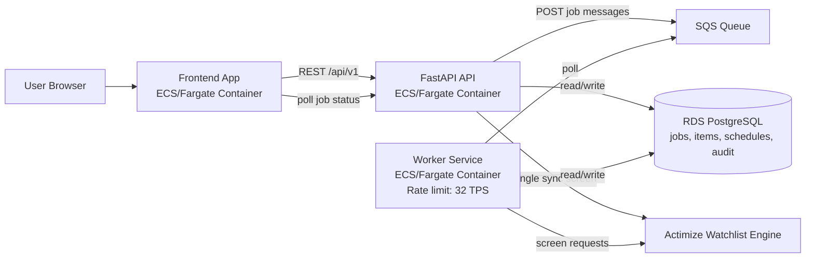
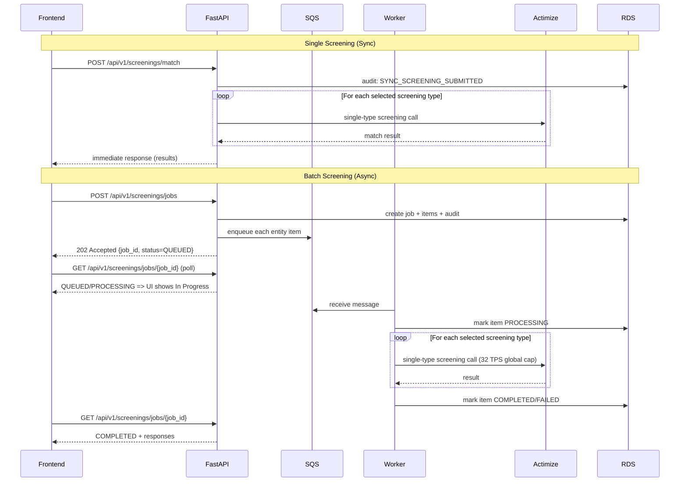
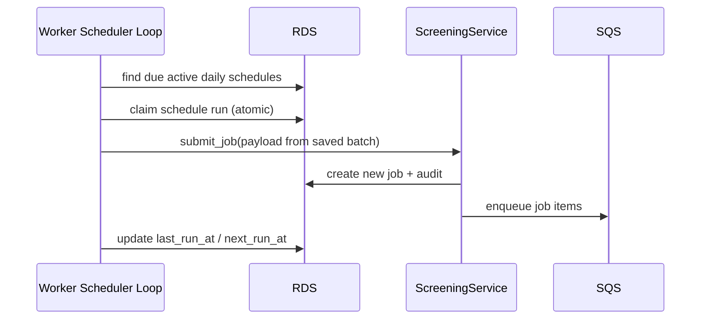

# OFAC Screening Enterprise App

This repository has been upgraded to an enterprise-style architecture:

- Frontend: React + Vite, containerized (Nginx runtime)
- Backend API: FastAPI
- Queue: AWS SQS (LocalStack in local Docker setup)
- Screening engine: Actimize Watchlist adapter (single-request model)
- Throughput control: Worker-side throttle at 32 TPS

## Architecture

1. Single-screen flow: frontend calls FastAPI sync endpoint for immediate Actimize response.
2. Batch flow: frontend submits job to FastAPI; API persists job + items and enqueues one SQS message per entity.
3. Worker consumes SQS, screens each entity with Actimize (or mock mode), and enforces `32 TPS`.
4. Worker stores normalized batch results back in SQLite.
5. Frontend polls batch job status and renders results when complete.
6. Users can select one or many screening types (`Sanction`, `PEP`, `AME`, `Fincen 314(a)`, `Global Sanction`) in both single and batch modes.
7. Single screening supports `mock_screening` mode: hit-check only (no Actimize alert) or alert generation.
8. Batch supports `daily_screening`: if selected, the worker re-runs that batch daily shortly after midnight Eastern (`America/New_York`, default `00:05`).
9. Users can disable daily screening for a scheduled batch directly from Screening Results using the `Disable Daily` action.

### Architecture Diagram



### API Flow Pattern



### Daily Screening Pattern



PDF version of these diagrams: `docs/architecture-api-flow.pdf`

## Technical Design Document

- TDD (Markdown, includes Mermaid diagrams): `docs/technical-design-document.md`
- TDD (Word-openable document): `docs/technical-design-document.doc`

## Key Paths

- Frontend API client: `src/api/openSanctions.ts`
- FastAPI app: `backend/app/main.py`
- SQS worker: `backend/app/worker.py`
- Actimize adapter: `backend/app/actimize.py`
- Persistence: `backend/app/repository.py`
- Local stack orchestration: `docker-compose.yml`

## Local Run (Containerized)

```bash
docker compose up --build
```

Endpoints:

- Frontend: `http://localhost:8080`
- Backend health: `http://localhost:8000/health`
- LocalStack (SQS): `http://localhost:4566`

## Environment Variables

Frontend (`.env`, see `.env.example`):

- `VITE_SCREENING_API_BASE_URL` default `/api/v1`
- `VITE_SCREENING_POLL_INTERVAL_MS` default `750`
- `VITE_SCREENING_JOB_TIMEOUT_MS` default `90000`
- `VITE_AUTH_ENABLED` default `true` (`false` disables OIDC and uses local admin mode)
- `VITE_OIDC_AUTHORITY` ex Keycloak: `http://localhost:8081/realms/screening-local`
- `VITE_OIDC_AUTHORITY` ex Cognito: `https://cognito-idp.<region>.amazonaws.com/<user_pool_id>`
- `VITE_OIDC_CLIENT_ID` ex: `screening-frontend` (Keycloak) or `<cognito_app_client_id>`
- `VITE_OIDC_REDIRECT_URI` ex: `http://localhost:8080/`
- `VITE_OIDC_POST_LOGOUT_REDIRECT_URI` ex: `http://localhost:8080/signed-out`
- `VITE_OIDC_SCOPE` ex: `openid profile email` (Cognito)
- `VITE_OIDC_IDLE_TIMEOUT_MS` ex: `900000` (15 minutes; set `0` to disable idle auto-logout)
- `VITE_OIDC_CLEAR_SESSION_ON_CLOSE` ex: `true` (stores OIDC session in `sessionStorage`; clears on tab/browser close)

Frontend runtime config in container:
- In ECS, frontend reads `VITE_*` values at container startup from environment variables (no image rebuild needed).
- Runtime values are written to `/app-config.js` by `frontend/entrypoint.sh`.

Backend/Worker (`backend/.env.example`):

- `APP_DB_URL` optional. If set to a `postgresql://...` URL, backend/worker use PostgreSQL instead of SQLite (`APP_DB_PATH`).
- `SCREENING_TPS=32` for Actimize single-request throughput
- `ACTIMIZE_MOCK=true` for local simulation
- Set `ACTIMIZE_MOCK=false` + `ACTIMIZE_BASE_URL` + `ACTIMIZE_API_KEY` for real engine
- `DAILY_SCREENING_TIMEZONE=America/New_York`
- `DAILY_SCREENING_HOUR=0`
- `DAILY_SCREENING_MINUTE=5`
- `AUTH_ENABLED=true`
- `AUTH_ISSUER=http://localhost:8081/realms/screening-local`
- `AUTH_JWKS_URL=http://localhost:8081/realms/screening-local/protocol/openid-connect/certs`
- `AUTH_AUDIENCE=` (optional; leave blank to skip audience validation in local simulation)
- `AUTH_ALGORITHMS=RS256`
- Cognito backend example:
  - `AUTH_ISSUER=https://cognito-idp.<region>.amazonaws.com/<user_pool_id>`
  - `AUTH_JWKS_URL=https://cognito-idp.<region>.amazonaws.com/<user_pool_id>/.well-known/jwks.json`
  - `AUTH_AUDIENCE=<cognito_app_client_id>`

## OIDC/OAuth2 Local Simulation (Keycloak)

1. Start the stack (includes Keycloak):
   ```bash
   docker compose up --build
   ```
2. Keycloak realm is auto-imported from `docs/keycloak/realm-screening-local.json`.
3. Keycloak admin console: `http://localhost:8081` (admin/admin).
4. Preloaded test users:
   - `screening.admin` / `Admin123!` (read + write + admin)
   - `screening.analyst` / `Analyst123!` (read + write)
   - `screening.viewer` / `Viewer123!` (read only)
5. If you prefer manual setup, create realm/client with:
   - Realm: `screening-local`
   - Client: `screening-frontend` (Public, Standard Flow ON, PKCE S256 ON)
   - Redirect URIs: `http://localhost:8080/*` and `http://localhost:5173/*`
   - Web Origins: `http://localhost:8080`, `http://localhost:5173`
6. Add realm roles (or equivalent scopes in your IdP mapping):
   - `screening.read`
   - `screening.write`
   - `screening.admin`
7. Start app with env from `.env.example` and `backend/.env.example`.

Legacy manual Keycloak bootstrap:
1. Start only Keycloak:
   ```bash
   docker run --name keycloak -p 8081:8080 \
     -e KEYCLOAK_ADMIN=admin \
     -e KEYCLOAK_ADMIN_PASSWORD=admin \
     quay.io/keycloak/keycloak:latest start-dev
   ```

Authorization behavior:
- Frontend requires OIDC sign-in before app access.
- Backend requires JWT bearer token for screening APIs.
- Role/capability model:
  - `Viewer`: single screening in mock mode only
  - `Analyst`: single + batch screening
  - `Compliance`: single + batch + daily schedule management
  - `Admin`: compliance permissions + user administration + audit log access
- Cognito groups supported in token claims (`cognito:groups`) and mapped to app roles.

## API Endpoints

- `POST /api/v1/screenings/jobs` create async job
- `GET /api/v1/screenings/jobs/{job_id}` get progress/result
- `POST /api/v1/screenings/match` synchronous screening (no queue, immediate response)
- `GET /api/v1/screenings/daily-schedules` list active daily schedules
- `DELETE /api/v1/screenings/daily-schedules/{schedule_id}` disable one daily schedule
- `GET /api/v1/audit-events?limit=200&user_id=<id>` read audit trail

## Notes

- Frontend uses `matchSync(...)` for single screening and `matchBatch(...)` for async batch screening.
- Failed item responses are normalized with `status=500` so UI can still render deterministic rows.
- Current local persistence uses SQLite for simplicity; production can swap repository to RDS/DynamoDB.
- Audit trail is persisted in `audit_events` table with timestamp, user, action, entity and request details.
