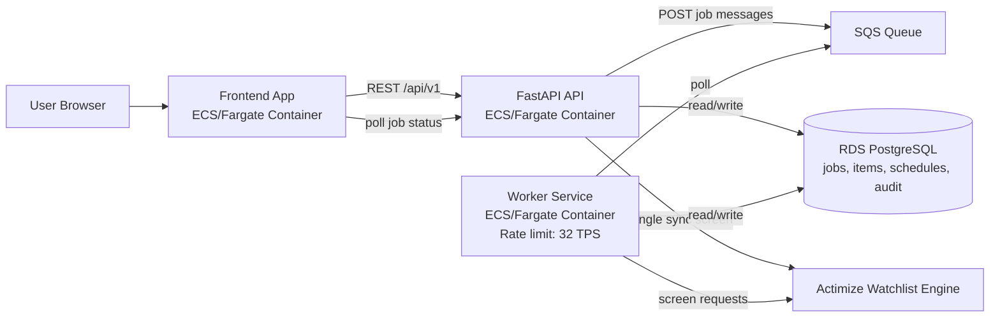
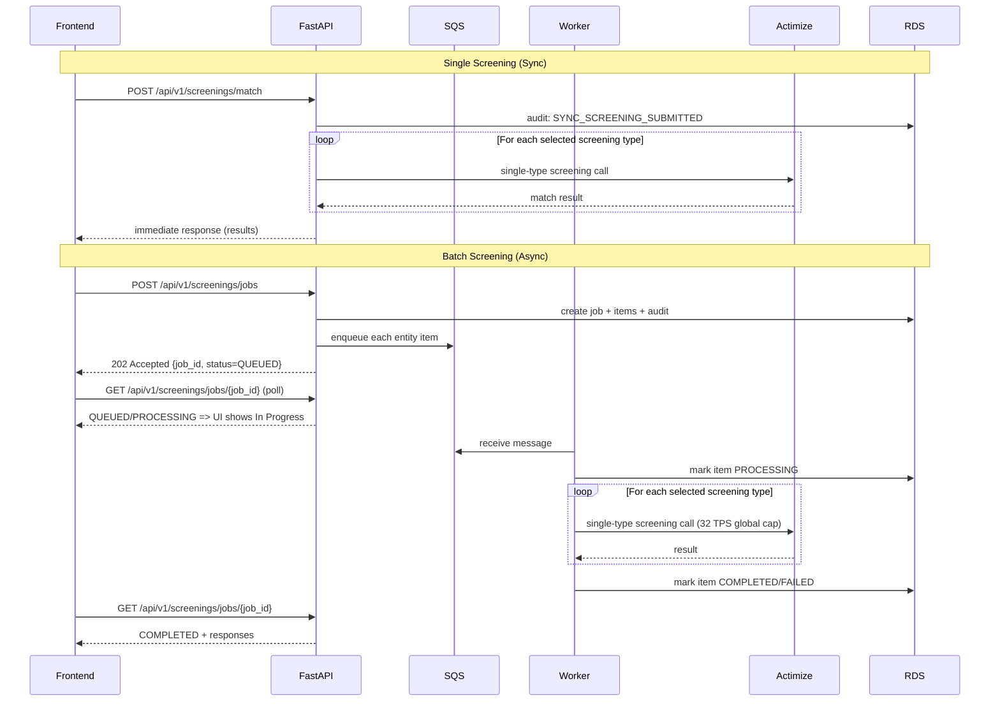
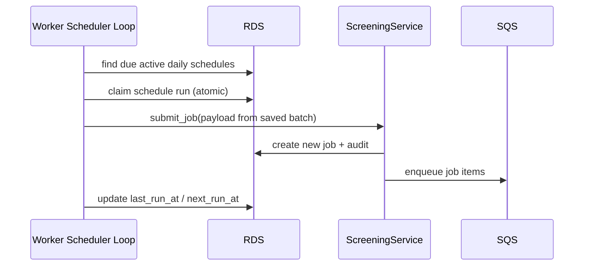

# OFAC Screening Enterprise App

This repository has been upgraded to an enterprise-style architecture:

- Frontend: React + Vite, containerized (Nginx runtime)
- Backend API: FastAPI
- Queue: AWS SQS (LocalStack in local Docker setup)
- Screening engine: Actimize Watchlist adapter (single-request model)
- Throughput control: Worker-side throttle at 32 TPS

## Architecture

1. Single-screen flow: frontend calls FastAPI sync endpoint for immediate Actimize response.
2. Batch flow: frontend submits job to FastAPI; API persists job + items and enqueues one SQS message per entity.
3. Worker consumes SQS, screens each entity with Actimize (or mock mode), and enforces `32 TPS`.
4. Worker stores normalized batch results back in SQLite.
5. Frontend polls batch job status and renders results when complete.
6. Users can select one or many screening types (`Sanction`, `PEP`, `AME`, `Fincen 314(a)`, `Global Sanction`) in both single and batch modes.
7. Single screening supports `mock_screening` mode: hit-check only (no Actimize alert) or alert generation.
8. Batch supports `daily_screening`: if selected, the worker re-runs that batch daily shortly after midnight Eastern (`America/New_York`, default `00:05`).
9. Users can disable daily screening for a scheduled batch directly from Screening Results using the `Disable Daily` action.

### Architecture Diagram



### API Flow Pattern



### Daily Screening Pattern



PDF version of these diagrams: `docs/architecture-api-flow.pdf`

## Key Paths

- Frontend API client: `src/api/openSanctions.ts`
- FastAPI app: `backend/app/main.py`
- SQS worker: `backend/app/worker.py`
- Actimize adapter: `backend/app/actimize.py`
- Persistence: `backend/app/repository.py`
- Local stack orchestration: `docker-compose.yml`

## Local Run (Containerized)

```bash
docker compose up --build
```

Endpoints:

- Frontend: `http://localhost:8080`
- Backend health: `http://localhost:8000/health`
- LocalStack (SQS): `http://localhost:4566`

## Environment Variables

Frontend (`.env`, see `.env.example`):

- `VITE_SCREENING_API_BASE_URL` default `/api/v1`
- `VITE_SCREENING_POLL_INTERVAL_MS` default `750`
- `VITE_SCREENING_JOB_TIMEOUT_MS` default `90000`

Backend/Worker (`backend/.env.example`):

- `SCREENING_TPS=32` for Actimize single-request throughput
- `ACTIMIZE_MOCK=true` for local simulation
- Set `ACTIMIZE_MOCK=false` + `ACTIMIZE_BASE_URL` + `ACTIMIZE_API_KEY` for real engine
- `DAILY_SCREENING_TIMEZONE=America/New_York`
- `DAILY_SCREENING_HOUR=0`
- `DAILY_SCREENING_MINUTE=5`

## API Endpoints

- `POST /api/v1/screenings/jobs` create async job
- `GET /api/v1/screenings/jobs/{job_id}` get progress/result
- `POST /api/v1/screenings/match` synchronous screening (no queue, immediate response)
- `GET /api/v1/audit-events?limit=200&user_id=<id>` read audit trail

## Notes

- Frontend uses `matchSync(...)` for single screening and `matchBatch(...)` for async batch screening.
- Failed item responses are normalized with `status=500` so UI can still render deterministic rows.
- Current local persistence uses SQLite for simplicity; production can swap repository to RDS/DynamoDB.
- Audit trail is persisted in `audit_events` table with timestamp, user, action, entity and request details.
