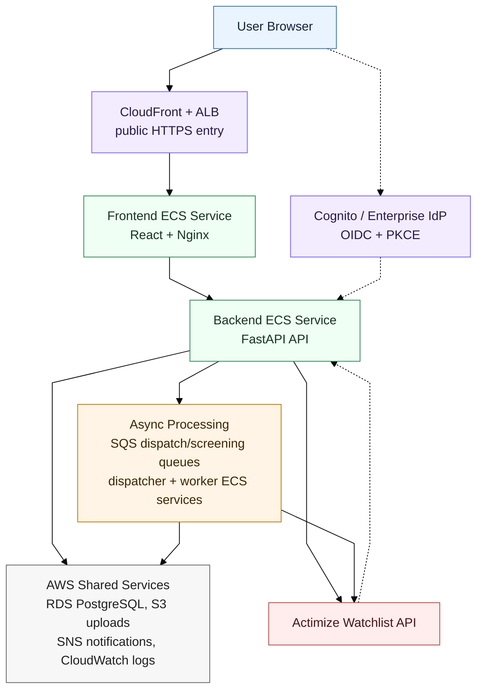
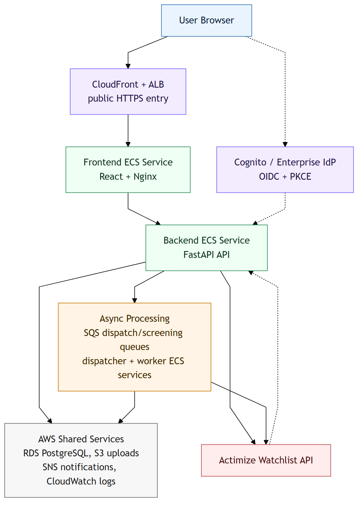
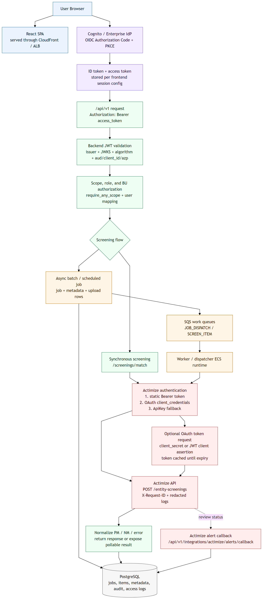
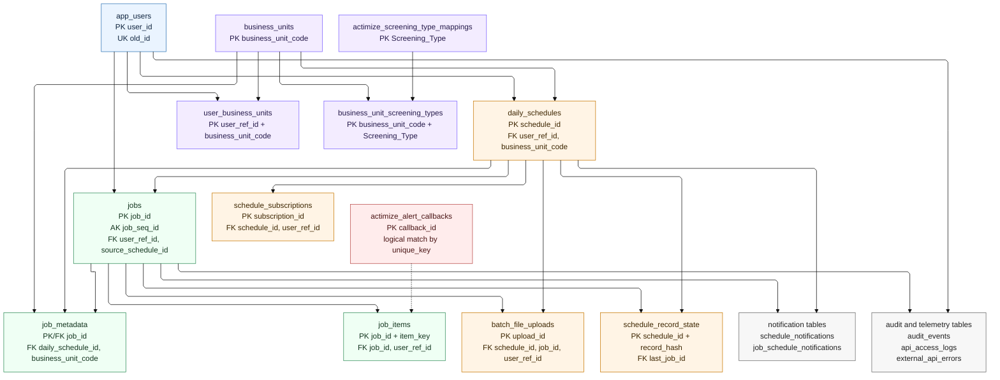
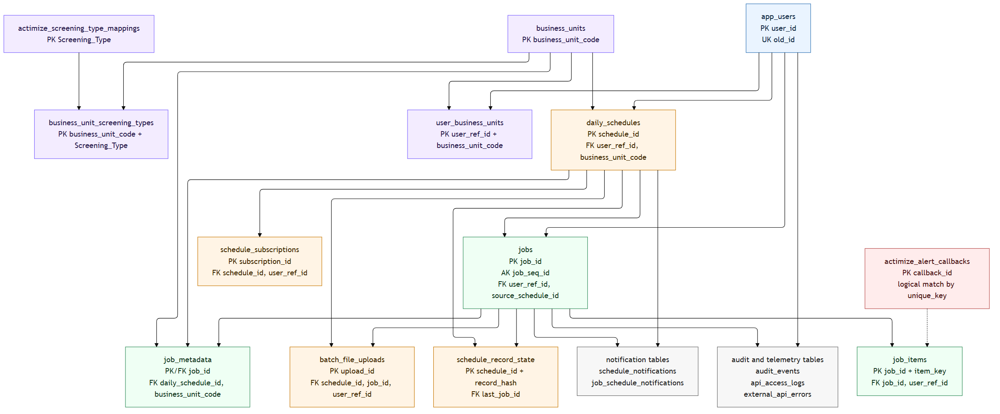

# Technical Design Document (TDD): OFAC / Watchlist Screening Platform

**Version:** 2.2
**Date:** 2026-05-19
**Repo:** `ofac-screening-aws`

This document describes the current technical design for the OFAC / watchlist screening platform. It is aligned to the latest repository code for the FastAPI backend, React/Vite frontend, SQS worker, PostgreSQL schema, and AWS deployment artifacts.

## Document Control

| Field | Value |
|---|---|
| Document Name | OFAC / Watchlist Screening Platform Technical Design Document |
| Current Version | 2.2 |
| Version Date | 2026-05-19 |
| Repository | `ofac-screening-aws` |
| Primary Audience | Engineering, QA, DevOps, Security, Compliance stakeholders |
| Source of Truth | Latest committed and in-work repository code plus deployment artifacts |
| Generated Output | `docs/technical-design-document.docx` |

## Version History

| Version | Date | Change Summary |
|---|---|---|
| 2.2 | 2026-05-19 | Added explicit OIDC authentication flow, Actimize authentication behavior, and end-to-end API flow diagram. |
| 2.1 | 2026-05-19 | Added database ER diagram source and rendered image under the Data Model section. |
| 2.0 | 2026-05-19 | Aligned TDD to current backend, frontend, worker, split queue dispatcher, paged daily schedule admin, BU-scoped screening types, Actimize callback handling, and updated QA coverage. Added architecture image, document index, and explicit version history. |
| 1.9 | 2026-05-06 | Documented backend-parsed batch uploads, large-batch `JOB_DISPATCH`, summary/results split, materialized views, audit access logs, raw upstream logging, worker retries, structured name/alias mapping, and DB-driven screening-type mapping. |
| 1.8 and earlier | Before 2026-05-06 | Earlier architecture and workflow baseline for single screening, batch screening, scheduled screening, AWS deployment, and core data model. |

## Versioning Policy

- TDD versions use major.minor numbering.
- Increment the minor version for additive architecture, API, workflow, QA, or operational documentation updates.
- Increment the major version for material platform redesigns, incompatible API contracts, or major deployment topology changes.
- Update the `Version History` table whenever regenerating `technical-design-document.docx` for release or stakeholder review.

## Index

| Section | Title |
|---|---|
| 1 | System Overview |
| 2 | Deployed AWS Architecture |
| 3 | Security, Authentication, and API Flows |
| 4 | Roles and Permissions |
| 5 | Frontend Application |
| 6 | Backend API Catalog |
| 7 | Backend and Worker Processing Flows |
| 8 | Data Model and ER Diagram |
| 9 | Screening Type and Actimize Mapping |
| 10 | Batch File Rules |
| 11 | Operational Configuration |
| 12 | Quality and Test Coverage Notes |

## Revision Summary

- Daily schedule administration now uses paged APIs and UI controls:
  - `GET /api/v1/screenings/daily-schedules?page=N` returns `DailyScheduleInfoPage` with a fixed backend page size of `10`.
  - `GET /api/v1/screenings/daily-schedules/batch-runs?page=N` returns `DailyScheduleBatchRunStatusPage` with a fixed backend page size of `50`.
- Daily schedule admin now displays the schedule owner (`Scheduled By`), source file, frequency, next-run time, and admin batch-run status across users.
- Ad-hoc schedule rerun is exposed through `POST /api/v1/screenings/daily-schedules/{schedule_id}/rerun`.
- Schedule result subscriptions are exposed through `GET`, `POST`, and `DELETE` endpoints under `/api/v1/screenings/daily-schedules/{schedule_id}/subscriptions`.
- Screening type options can be requested with `business_unit_code` so the UI can load business-unit-aware options.
- Batch upload remains backend parsed: the frontend submits source file plus metadata; backend validates CSV/XLSX rows and returns `row_meta`.
- Large immediate batch upload remains S3/SQS backed through a `JOB_DISPATCH` control message to avoid proxy/origin timeouts.
- Queue configuration now supports separate dispatch and screening queues with `AWS_DISPATCH_SQS_QUEUE_NAME` and `AWS_SCREENING_SQS_QUEUE_NAME`; the legacy `AWS_SQS_QUEUE_NAME` remains the default for both when split queues are not configured.
- `worker_app.dispatcher` can run as a dispatch-only worker that consumes `JOB_DISPATCH` messages, expands large jobs into the screening queue, and forwards unexpected `SCREEN_ITEM` messages when queues are split.
- Worker health now exposes `/health` on the configured worker health host/port and tracks recent worker activity.
- Worker retry behavior includes retry attempt tracking, delayed SQS requeue for transient upstream errors, and visibility timeout extension for in-flight items.
- Backend audit/event APIs include paged retrieval with `errors_only`, access logging, retention cleanup, and high-risk external API failure audit alerts.
- Business unit administration includes CRUD for business units and user-to-business-unit mappings.
- The Actimize alert callback endpoint accepts review status callbacks and applies alert status back to stored item responses.
- Runtime validates database schema on startup; schema creation/migration is expected to run as a separate setup/deployment step.
- Added a database ER diagram to the Data Model section for stakeholder review.
- Added explicit OIDC authentication, Actimize authentication, and API flow documentation for review.

## 1. System Overview

The platform supports these primary workflows:

- **Single Screening (Sync):** a user submits one entity through `POST /api/v1/screenings/match` and receives a normalized response immediately.
- **Batch Screening (Async):** a user uploads a CSV/XLSX file through `POST /api/v1/screenings/batch-upload`; backend stores upload metadata, creates a job, and enqueues work.
- **Large Batch Dispatch:** for large immediate uploads, backend stores the source file and generated query payload in S3, then sends a single `JOB_DISPATCH` SQS message for the worker to expand into `SCREEN_ITEM` messages.
- **Scheduled Screening:** compliance/admin users create daily, weekly, or monthly schedules. The worker checks due schedules, claims them, submits new jobs, and updates next-run timestamps.
- **Result Review:** users load summary counters, recent results, job progress, schedule status, and audit information through backend APIs.
- **Administration:** admin/useradmin users manage business units, user mappings, audit visibility, and operational review.

## 2. Deployed AWS Architecture

### AWS Components

| Component | Responsibility |
|---|---|
| CloudFront | Public HTTPS entrypoint and browser-compatible origin for OIDC/PKCE flow. |
| ALB | Routes public app traffic to the frontend service. |
| Frontend ECS service | Serves static SPA assets and reverse-proxies `/api/*` to backend. |
| Backend ECS service | FastAPI REST API, sync screening, upload handling, audit/access logging. |
| Dispatcher ECS runtime | Optional split-queue consumer for `JOB_DISPATCH` messages that expands large jobs into screening items. |
| Worker ECS service | SQS consumer, schedule loop, retry/requeue handling, notification dispatch. |
| SQS | Async work queues for `SCREEN_ITEM` and `JOB_DISPATCH` messages. Deployments may use one queue or split dispatch/screening queues. |
| RDS PostgreSQL | Persistent data store for jobs, schedules, audit, uploads, mappings, and results. |
| S3 | Source upload storage and large-batch `queries.json` payload storage. |
| SNS | Optional scheduled screening email notification transport. |
| Cognito / IdP | OIDC login, token issuance, and role/group claims. |
| CloudWatch | Runtime logs, troubleshooting, and raw upstream log stream destination. |

## 3. Security, Authentication, and API Flows

### Frontend

- Uses OIDC Authorization Code + PKCE via `react-oidc-context`.
- Stores OIDC session in `sessionStorage` or `localStorage` based on `VITE_OIDC_CLEAR_SESSION_ON_CLOSE`.
- Sends `Authorization: Bearer <access_token>` for backend calls.
- Hides or disables UI actions based on decoded permissions, but backend remains the enforcement point.
- Does not call the worker directly.

### Backend

- Enforces endpoint permissions with `require_any_scope`.
- Validates JWT issuer, signature, expiration, allowed algorithms, and audience-like claims (`aud`, `client_id`, or `azp`) when `AUTH_ENABLED=true`.
- Provides local-dev fallback principal with admin-like scopes when `AUTH_ENABLED=false`; deployment configuration must explicitly enable auth for protected environments.
- Logs `/api/v1/*` access events with correlation id, sanitized query strings, status code, latency, auth state, user context, and selected error details.
- Redacts sensitive query keys such as token, password, secret, access token, and client secret.

### OIDC Authentication Flow

1. Browser loads the React SPA through CloudFront, ALB, and the frontend ECS service.
2. When frontend auth is enabled, the SPA starts OIDC Authorization Code + PKCE against Cognito or an enterprise IdP federation endpoint.
3. After successful login, the browser receives the authorization-code redirect and exchanges it with the PKCE verifier for ID/access tokens.
4. The frontend stores the OIDC session according to `VITE_OIDC_CLEAR_SESSION_ON_CLOSE` and related `VITE_OIDC_*` settings.
5. Frontend API calls send `Authorization: Bearer <access_token>` to backend `/api/v1/*` endpoints.
6. Backend validates the token with configured issuer, JWKS URL, allowed algorithms, and audience-like claims (`aud`, `client_id`, or `azp`).
7. Backend derives roles from token scopes/groups/claims, maps them to application permissions, and applies endpoint-level `require_any_scope` checks plus business-unit authorization where required.

### Actimize Authentication and API Flow

- Browser clients never call Actimize directly; all screening calls go through backend or worker/dispatcher services.
- The Actimize client sends JSON requests to `{ACTIMIZE_BASE_URL}/entity-screenings` with `Content-Type: application/json` and a generated `X-Request-ID`.
- Outbound authentication is selected in this order:
  - Static bearer token from `ACTIMIZE_BEARER_TOKEN`.
  - OAuth `client_credentials` access token from `ACTIMIZE_TOKEN_URL` using either `ACTIMIZE_CLIENT_SECRET` or a JWT client assertion built from `ACTIMIZE_CLIENT_ASSERTION_*`.
  - API key fallback from `ACTIMIZE_API_KEY`.
- OAuth access tokens are cached until shortly before expiry to avoid requesting a token for every screening item.
- Transient Actimize failures (`408`, `429`, `500`, `502`, `503`, `504`) are retried by the Actimize client; worker-side retry/requeue handles retryable per-item failures.
- Raw request/response logging is optional and redacts token, API key, client secret, client assertion, password, and authorization fields before writing to CloudWatch.
- Actimize alert review callbacks enter through `/api/v1/integrations/actimize/alerts/callback`; callback authenticity should be protected by deployment-level identity or network controls.

### End-to-End Flow Diagram

Mermaid source: `docs/authentication-api-flow.mmd`.

### Worker

- Has no browser-facing API other than its local health endpoint.
- Trusts work that was already authorized by backend before enqueue.
- Uses ECS task role / AWS permissions for SQS, S3, SNS, and DB access.
- In split-queue mode, the normal worker consumes the screening queue while `worker_app.dispatcher` consumes the dispatch queue and expands large jobs into the screening queue.

### External Callbacks

- `POST /api/v1/integrations/actimize/alerts/callback` accepts Actimize alert review callbacks and applies status back to stored screening item responses.
- The callback payload includes `unique_key`, `alert_id`, `status_cd`, and optional screening/source metadata.
- Production deployments should protect the callback path at the network or identity layer and validate callback authenticity before accepting mutations.

## 4. Roles and Permissions

| Role Intent | Effective Capability |
|---|---|
| Viewer | Read access plus mock single screening only. |
| Analyst | Single and batch screening. |
| Compliance | Analyst permissions plus scheduled screening and schedule administration. |
| User Admin | Business unit and user mapping administration. |
| Admin | Full compliance, user administration, audit, and operational visibility. |

Backend scope checks are the source of truth. Frontend role checks are used for navigation and ergonomics only.

## 5. Frontend Application

### Routes

| Route | Screen | Purpose |
|---|---|---|
| `/` | Redirect | Redirects to `/intro`. |
| `/intro` | Intro page | Application landing/overview for authenticated users. |
| `/screening` | Screening workspace | Single, batch, schedule creation, results, and summary views. |
| `/daily-schedules` | Daily schedule admin | Active schedule list, paged schedule table, batch run status, remove, rerun. |
| `/manage-users` | User administration | Business unit CRUD and user-to-BU mappings. |
| `/audit-logs` | Audit log page | Paged audit and errors-only review for admin/useradmin users. |
| `/signed-out` | Signed-out flow | Post-logout screen and sign-in again action. |

### Frontend Runtime Configuration

The frontend container writes `/usr/share/nginx/html/app-config.js` at startup from `VITE_*` environment variables. Nginx also generates reverse-proxy configuration at startup and forwards `/api/` to `BACKEND_UPSTREAM`.

Important frontend settings:

| Variable | Purpose |
|---|---|
| `VITE_SCREENING_API_BASE_URL` | API base path, default `/api/v1`. |
| `VITE_SCREENING_POLL_INTERVAL_MS` | Job polling interval. |
| `VITE_SCREENING_JOB_TIMEOUT_MS` | Job wait timeout for UI helper flows. |
| `VITE_AUTH_ENABLED` | Enables OIDC in frontend. |
| `VITE_OIDC_*` | OIDC authority, client id, redirect URIs, scope, and session settings. |
| `VITE_ACTIMIZE_REVIEW_ALERT_URL` | Optional review-alert navigation URL used in result/review flows. |

## 6. Backend API Catalog

| Endpoint | Method | Scope | Response / Behavior |
|---|---|---|---|
| `/health` | GET | Public | Basic backend health response. |
| `/api/v1/screenings/match` | POST | `screening.write` or `screening.single.mock` or `screening.admin` | Synchronous screening. Viewer-style users are limited to mock mode. Requires mapped business unit. |
| `/api/v1/screenings/jobs` | POST | `screening.write` or `screening.daily` or `screening.admin` | Creates async job from JSON payload and enqueues item work. |
| `/api/v1/screenings/batch-upload` | POST | `screening.write` or `screening.daily` or `screening.admin` | Accepts CSV/XLSX upload and metadata; backend parses rows; scheduled uploads require daily/admin scope. |
| `/api/v1/screenings/jobs/{job_id}` | GET | `screening.read` | Returns job counts, terminal responses, and status. |
| `/api/v1/screenings/summary` | GET | `screening.read` | Returns aggregate counts for current user. |
| `/api/v1/screenings/results?limit=N` | GET | `screening.read` | Returns normalized recent result rows, default `1000`, max `5000`. |
| `/api/v1/screenings/submissions?limit=N` | GET | `screening.read` | Returns user submission history. |
| `/api/v1/screenings/types?business_unit_code=BU` | GET | `screening.read` | Returns active screening-type options, optionally scoped by business unit. |
| `/api/v1/screenings/daily-schedules?page=N` | GET | `screening.read` | Returns `DailyScheduleInfoPage`; backend page size `10`. |
| `/api/v1/screenings/daily-schedules/batch-runs?page=N` | GET | `screening.admin` | Returns `DailyScheduleBatchRunStatusPage`; backend page size `50`. |
| `/api/v1/screenings/daily-schedules/{schedule_id}` | DELETE | `screening.daily` or `screening.admin` | Deactivates an active schedule and writes audit event. |
| `/api/v1/screenings/daily-schedules/{schedule_id}/rerun` | POST | `screening.daily` or `screening.admin` | Creates an ad-hoc run from the stored schedule. |
| `/api/v1/screenings/daily-schedules/{schedule_id}/subscriptions` | GET | `screening.read` | Lists current user's subscriptions for a schedule. |
| `/api/v1/screenings/daily-schedules/{schedule_id}/subscriptions?email=` | POST | `screening.read` | Subscribes an allowed email address for schedule completion notices. |
| `/api/v1/screenings/daily-schedules/{schedule_id}/subscriptions?email=` | DELETE | `screening.read` | Removes a schedule subscription. |
| `/api/v1/business-units` | GET | `screening.read` | Lists active business units mapped to current user. |
| `/api/v1/admin/business-units` | GET | `screening.admin` or `screening.useradmin` | Lists all business units, optionally including inactive rows. |
| `/api/v1/admin/business-units` | POST | `screening.admin` or `screening.useradmin` | Creates a business unit. |
| `/api/v1/admin/business-units/{business_unit_code}` | PUT | `screening.admin` or `screening.useradmin` | Updates business unit code/name. |
| `/api/v1/admin/business-units/{business_unit_code}` | DELETE | `screening.admin` or `screening.useradmin` | Deactivates a business unit. |
| `/api/v1/admin/business-unit-mappings` | GET | `screening.admin` or `screening.useradmin` | Lists user-to-business-unit mappings. |
| `/api/v1/admin/business-unit-mappings/{user_id}` | PUT | `screening.admin` or `screening.useradmin` | Replaces a user's active business unit mapping set. |
| `/api/v1/admin/users` | GET | `screening.admin` or `screening.useradmin` | Lists known users from DB plus Cognito where available. |
| `/api/v1/audit-events` | GET | `screening.admin` or `screening.useradmin` | Legacy offset/limit audit list. |
| `/api/v1/audit-events/page` | GET | `screening.admin` or `screening.useradmin` | Paged audit API with `errors_only`. |
| `/api/v1/integrations/actimize/alerts/callback` | POST | Integration controlled | Records Actimize review callback and updates matching item responses. |

## 7. Backend and Worker Processing Flows

### 7.1 Single Screening

1. Browser submits an entity payload to `/api/v1/screenings/match`.
2. Backend checks auth scope, mock-mode constraints, and business unit mapping.
3. Backend resolves DB-driven screening type mappings.
4. Backend calls Actimize for each selected screening type.
5. Backend normalizes response into `EntityMatchResponse`, writes audit/access events, and returns the result.

### 7.2 Immediate Batch Upload

1. Browser posts CSV/XLSX plus metadata to `/api/v1/screenings/batch-upload`.
2. Backend validates multipart size, extension, screening types, business unit, schedule flags, and file body.
3. Backend stores file metadata in `batch_file_uploads`.
4. If S3 is enabled, backend uploads source file and generated query payload.
5. Backend returns `BatchUploadAccepted` with `job_id`, `source_upload_id`, and `row_meta`.
6. Worker consumes queued messages and writes `job_items` status/results.

### 7.3 Large Batch `JOB_DISPATCH`

1. Backend creates a job quickly and enqueues one `JOB_DISPATCH` message.
2. In single-queue mode, the worker consumes the dispatch message directly. In split-queue mode, `worker_app.dispatcher` consumes it from `AWS_DISPATCH_SQS_QUEUE_NAME`.
3. Dispatcher/worker downloads generated `queries.json` from S3.
4. Dispatcher/worker bulk-inserts item records and enqueues `SCREEN_ITEM` messages into the screening queue in SQS batches.
5. If a dispatch-only runtime receives a `SCREEN_ITEM` while queues are split, it forwards that item to the configured screening queue and audits the forwarding action.
6. Standard worker item processing completes each record from the screening queue.

### 7.4 Scheduled Screening

1. Compliance/admin creates or updates a schedule from the Schedule tab or batch-upload schedule path.
2. Backend persists `daily_schedules` with cadence, timezone, next run, upload/source metadata, and business unit.
3. Worker loop checks `list_due_daily_schedules`.
4. Worker atomically claims due schedule run.
5. Worker submits a new job from stored schedule/upload state.
6. Worker updates `last_run_at` and `next_run_at`.
7. Notification logic records/publishes completion messages once per scheduled job.

### 7.5 Worker Item Retry

1. Worker receives `SCREEN_ITEM`.
2. Worker extends visibility timeout for long work.
3. Retryable upstream failures (`429`, `500`, `502`, `503`, `504`) may be requeued with incremented `retry_attempt`.
4. Delay uses bounded exponential backoff from `SCREENING_ITEM_RETRY_INITIAL_DELAY_S` to `SCREENING_ITEM_RETRY_MAX_DELAY_S`.
5. Once max attempts are exhausted or failure is non-retryable, the item is marked failed.

## 8. Data Model

### Core Tables

| Table | Purpose |
|---|---|
| `app_users` | Stable internal user ids plus external/old id, name, email, active flag. |
| `jobs` | Top-level screening run state and counters. |
| `job_items` | Per-record request, response, status, parsed status, and error text. |
| `job_metadata` | UI/history metadata such as mode, selected screening types, schedule id, source file, deferred state, and business unit. |
| `daily_schedules` | Recurring schedule definition, owner, source upload, next run, active state, and BU. |
| `batch_file_uploads` | Source upload traceability, file hash, S3 locations, generated query payload locations, and record count. |
| `schedule_record_state` | Schedule-level dedupe state for incremental rescreening. |
| `schedule_subscriptions` | Per-user/email subscription rows for scheduled run completion notices. |
| `job_schedule_notifications` | Idempotency guard for schedule completion notification dispatch. |
| `schedule_notifications` | Notification outbox/audit trail. |
| `business_units` | Business unit catalog. |
| `user_business_units` | Active user-to-business-unit mappings. |
| `actimize_screening_type_mappings` | DB-driven screening-type mapping and display metadata. |
| `business_unit_screening_types` | Optional active screening-type allowlist by business unit. |
| `audit_events` | Compliance and operational audit trail. |
| `api_access_logs` | Request-level access logging for `/api/v1/*`. |
| `external_api_errors` | Upstream/API failure telemetry and alerting source. |
| `actimize_alert_callbacks` | Inbound Actimize review callback audit trail. |

### Entity Relationship Diagram

The diagram below focuses on application-owned relational tables and key relationships. Audit, access, notification, and integration telemetry tables are grouped where that keeps the TDD readable; the full table inventory remains in the table above and deployment DDL.

### Materialized Views

| View | Purpose |
|---|---|
| `mv_user_recent_results` | Fast recent result lookup per user. |
| `mv_user_result_summary_counts` | Fast summary counter lookup per user. |
| `mv_user_submission_jobs` | Fast submission history lookup. |
| `mv_daily_schedule_batch_runs` | Fast admin status view for schedule-triggered/ad-hoc runs. |

Runtime performs best-effort refresh of known materialized views at an interval controlled by `PG_RESULT_MV_REFRESH_INTERVAL_S`.

## 9. Screening Type and Actimize Mapping

Screening type options are stored in `actimize_screening_type_mappings` and exposed through `/api/v1/screenings/types`. The API accepts an optional `business_unit_code` to support business-unit-aware options and validates that the current user can access the requested BU.

Actimize request construction preserves structured identity data:

| Source Field | Actimize Target |
|---|---|
| `properties.partyKey` | `partyKey` |
| `schema` | `partyType` (`I` for person, `E` for entity) |
| `firstName`, `middleName`, `lastName`, `maidenName`, `fullName` | `names` |
| `alias`, `aliases` | `aliases[]` |
| `nationality`, `country` | `nationalities[]` |
| `address` | `addresses[]` |
| `idNumber`, `registrationNumber`, `ids` | `ids[]` |
| `birthDate` | `dateOfBirth` or `yearOfBirth` |
| `birthLocation` | `countryofBirth` |
| `gender` | Uppercase `gender` |
| selected screening type | Resolved `screeningType` |
| selected business unit | `businessUnit` |

Classification rules:

- HTTP `200` with Prudential/Actimize message `PM` maps to potential match.
- HTTP `200` with message `NM` maps to clear.
- Other statuses or unexpected messages map to failed/error handling.

## 10. Batch File Rules

Supported source files are `.csv` and `.xlsx`. Excel parsing uses the first worksheet. Header matching is case-insensitive and separator-tolerant.

Required and important fields:

| Template Field | Purpose |
|---|---|
| `PartyKey` | Required unique record key; becomes the item key and `properties.partyKey`. |
| `PartyType` / `CustomerType` | Determines individual vs entity schema. |
| `PrimaryFirstName`, `PrimaryMiddleName`, `PrimaryLastName`, `PrimaryMaidenName`, `PrimaryFullName` | Person/entity names. |
| `AliasName`, `Alias1*`, `Alias2*`, `Alias3*` | Free-form and structured aliases. |
| `DateOfBirth`, `Gender`, `CountryOfBirth`, `NationalityCountry1` | Person attributes. |
| `Address1*`, `Addresses`, `Countries`, `Address1Country` | Address/country attributes. |
| `PartyId1Value`, `PartyId1Type`, `PartyId1IDCountry` | ID attributes. |
| `Title`, `Notes` | Optional screening metadata. |

The backend parser returns `row_meta` in the batch upload accepted response so the UI can display placeholders without duplicate client parsing.

## 11. Operational Configuration

| Variable | Default | Purpose |
|---|---:|---|
| `APP_DB_PATH` | `/tmp/screening.db` | SQLite fallback path when no PostgreSQL URL is set. |
| `APP_DB_URL` | empty | PostgreSQL connection URL for AWS deployments. |
| `DB_POOL_MIN_SIZE` | `1` | Minimum PostgreSQL pool size. |
| `DB_POOL_MAX_SIZE` | `8` | Maximum PostgreSQL pool size. |
| `DB_POOL_TIMEOUT_S` | `5.0` | DB pool acquisition timeout. |
| `DB_CONNECT_MAX_ATTEMPTS` | `4` | DB acquisition retry attempts. |
| `PG_RESULT_MV_REFRESH_INTERVAL_S` | `20` | Best-effort materialized-view refresh interval. |
| `CORS_ALLOW_ORIGINS` | `*` | Comma-separated backend CORS origins. |
| `MULTIPART_MAX_PART_SIZE` | `25m` | Backend upload form max part size. |
| `AWS_REGION` | `us-east-1` | AWS client region. |
| `AWS_SQS_QUEUE_NAME` | `screening-requests` | Legacy/base SQS queue name used when split queues are not configured. |
| `AWS_DISPATCH_SQS_QUEUE_NAME` | `AWS_SQS_QUEUE_NAME` | Queue for `JOB_DISPATCH` control messages. |
| `AWS_SCREENING_SQS_QUEUE_NAME` | `AWS_SQS_QUEUE_NAME` | Queue for per-record `SCREEN_ITEM` messages. |
| `AWS_ENDPOINT_URL` | empty | Optional LocalStack/custom endpoint. |
| `AWS_S3_UPLOAD_BUCKET` | empty | Upload bucket; required for large batch dispatch. |
| `AWS_S3_UPLOAD_PREFIX` | `screening-input` | S3 key prefix. |
| `AWS_SNS_NOTIFICATIONS_ENABLED` | `false` | Enables SNS completion notification publishing. |
| `AWS_SNS_SCHEDULE_TOPIC_PREFIX` | `ofac-screening-schedule` | SNS topic prefix. |
| `AWS_SES_SENDER_EMAIL` | empty | Sender metadata for notifications. |
| `ACTIMIZE_BASE_URL` | empty | Actimize/Kong base URL. |
| `ACTIMIZE_PROVIDER` | `prudential` | Provider label for logs/audit/errors. |
| `ACTIMIZE_API_KEY` | empty | Optional API-key credential. |
| `ACTIMIZE_BEARER_TOKEN` | empty | Optional static bearer token. |
| `ACTIMIZE_TOKEN_URL` | empty | OAuth token endpoint for dynamic bearer token. |
| `ACTIMIZE_CLIENT_ID` | empty | OAuth client id. |
| `ACTIMIZE_CLIENT_SECRET` | empty | OAuth client secret. |
| `ACTIMIZE_CLIENT_ASSERTION_*` | varies | JWT client assertion configuration. |
| `ACTIMIZE_SCOPE` | empty | Optional OAuth scopes. |
| `ACTIMIZE_SOURCE_SYSTEM` | `AMLP` | Default source system in upstream payloads. |
| `ACTIMIZE_REQUESTER_NAME` | `SCREENING_SYSTEM` | Default requester name. |
| `ACTIMIZE_ALERT_REVIEW_URL` | empty | Optional review link for notification content. |
| `ACTIMIZE_TIMEOUT_S` | `20.0` | Upstream HTTP timeout. |
| `ACTIMIZE_LOG_RAW_API_IO` | `false` | Enables redacted raw upstream request/response logs. |
| `ACTIMIZE_RAW_API_LOG_MAX_CHARS` | `20000` | Max raw log payload characters. |
| `ACTIMIZE_SCREENING_TYPE_CACHE_TTL_S` | `60` | Screening-type mapping cache TTL. |
| `ACTIMIZE_SCREENING_TYPE_CACHE_MAX_ENTRIES` | `512` | Screening-type mapping cache max entries. |
| `SCREENING_TPS` | `32` | Per-worker outbound TPS cap. |
| `SCREENING_PARALLEL_MESSAGES` | `1` | Per-worker in-flight message cap. |
| `SCREENING_RESULT_LIMIT` | `5` | Max returned matches per item. |
| `SCREENING_ITEM_RETRY_MAX_ATTEMPTS` | `2` | Transient upstream retry attempts. |
| `SCREENING_ITEM_RETRY_INITIAL_DELAY_S` | `3` | Initial delayed retry backoff. |
| `SCREENING_ITEM_RETRY_MAX_DELAY_S` | `60` | Max delayed retry backoff. |
| `SCREENING_ITEM_VISIBILITY_TIMEOUT_S` | `300` | Visibility timeout extension for picked-up items. |
| `WORKER_HEALTH_HOST` | `127.0.0.1` | Worker health bind host. |
| `WORKER_HEALTH_PORT` | `8081` | Worker health bind port. |
| `WORKER_HEALTHCHECK_TIMEOUT_S` | `5.0` | Healthcheck probe timeout. |
| `WORKER_HEALTH_MAX_AGE_S` | `180` | Max heartbeat age before worker health degrades. |
| `DAILY_SCREENING_TIMEZONE` | `America/New_York` | Default schedule timezone. |
| `DAILY_SCREENING_HOUR` | `0` | Default schedule run hour. |
| `DAILY_SCREENING_MINUTE` | `5` | Default schedule run minute. |
| `DAILY_SCREENING_CHECK_INTERVAL_S` | `30` | Worker schedule check interval. |
| `AUDIT_ACCESS_LOG_ENABLED` | `true` | Enables API access logging. |
| `AUDIT_EVENT_RETENTION_DAYS` | `3650` | Audit retention window. |
| `API_ACCESS_LOG_RETENTION_DAYS` | `365` | API access-log retention window. |
| `EXTERNAL_API_ERROR_RETENTION_DAYS` | `365` | External error retention window. |
| `OPERATIONAL_CLEANUP_INTERVAL_S` | `3600` | Worker cleanup interval. |
| `HIGH_RISK_EXTERNAL_API_ERROR_WINDOW_MINUTES` | `15` | External failure alert window. |
| `HIGH_RISK_EXTERNAL_API_ERROR_THRESHOLD` | `10` | External failure alert threshold. |
| `AUTH_ENABLED` | `false` | Backend JWT validation toggle. Must be `true` in protected deployments. |
| `AUTH_ISSUER` | empty | JWT issuer. |
| `AUTH_JWKS_URL` | empty | JWKS URL. |
| `AUTH_AUDIENCE` | empty | Expected audience/client id. |
| `AUTH_ALGORITHMS` | `RS256` | Allowed JWT algorithms. |

## 12. Quality and Test Coverage Notes

The QA workbook should cover:

- Auth and RBAC for viewer, analyst, compliance, useradmin, and admin behavior.
- Business unit CRUD and user mapping flows.
- Sync screening validation and Actimize response normalization.
- Backend-parsed CSV/XLSX batch upload and large batch `JOB_DISPATCH`.
- Scheduled screening creation, dedupe, rerun, subscription, notifications, and paged admin views.
- Summary/results split and result filtering.
- Audit/access logs, errors-only paging, retention cleanup, and external API alerting.
- Worker health, retries, visibility timeout handling, and throughput limits.
- Negative cases for malformed uploads, unmapped business units, invalid callback payloads, and authorization failures.
