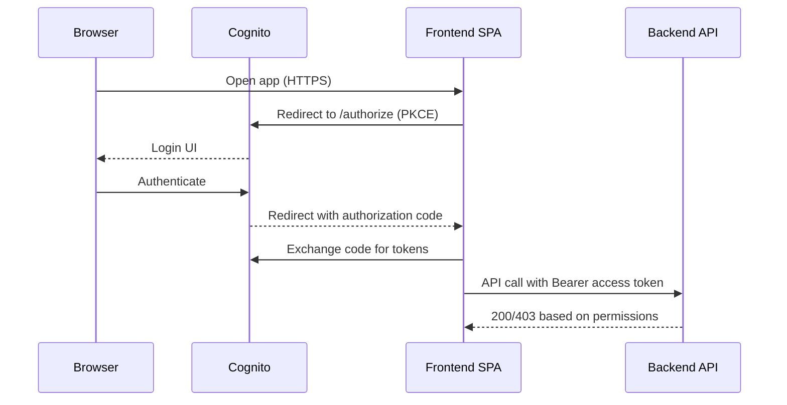
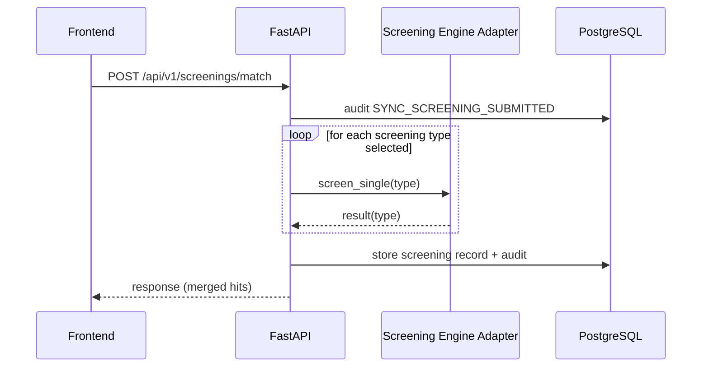
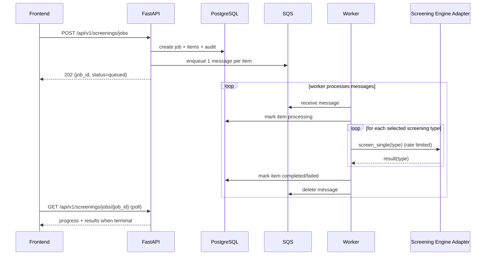
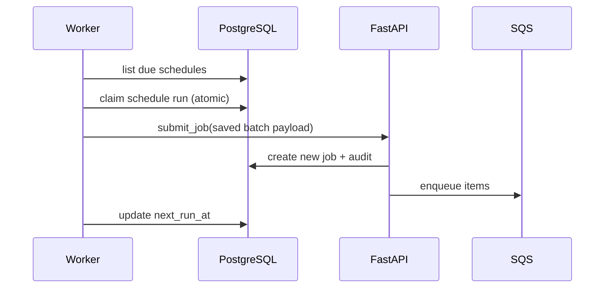
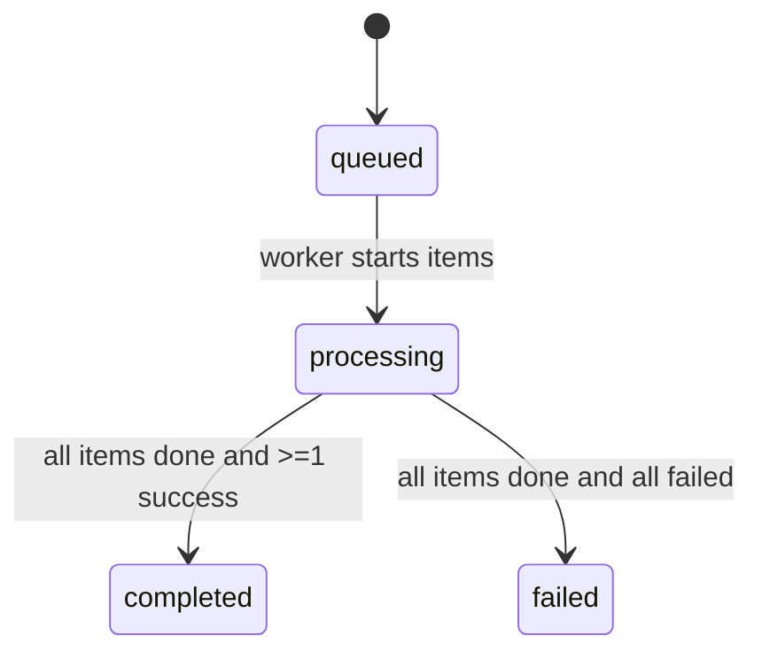
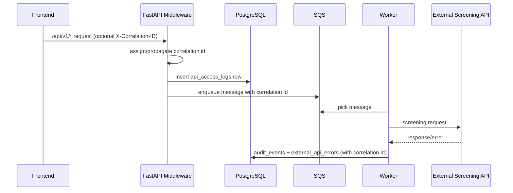

# Technical Design Document (TDD): OFAC / Watchlist Screening Platform

**Version:** 1.1  
**Date:** 2026-03-06  
**Repo:** `ofac-screening-aws`  

This document describes the technical design for the OFAC / watchlist screening platform deployed on AWS. It includes AWS architecture, API flows, process flows, and component responsibilities.

## 1. System Overview

The platform supports:
- **Single Screening (Sync):** user submits a single entity and receives an immediate response.
- **Batch Screening (Async):** user uploads a batch; the platform returns immediately with a job id; a worker processes in background.
- **Daily Screening (Scheduled):** selected batches are automatically re-screened daily shortly after midnight Eastern time.
- **AuthN/AuthZ:** OIDC login (AWS Cognito or enterprise IdP federation) and role-based authorization.
- **Audit Trail:** all key user/system actions are recorded for traceability.
- **API Access Logging:** every `/api/v1/*` request is logged with status, latency, auth state, and correlation id.
- **Operational Controls:** log retention and high-risk external API failure alerting.

## 2. AWS Architecture (Deployed View)

### 2.1 Logical Diagram

```mermaid
flowchart LR
  subgraph Internet[Public Internet]
    U[User Browser]
  end

  subgraph AWS[AWS Account]
    CF[CloudFront Distribution<br/>HTTPS]
    ALB[Application Load Balancer<br/>HTTP origin from CloudFront]

    subgraph VPC[VPC]
      subgraph ECS[ECS Cluster: Screening]
        FE[Frontend Service<br/>Fargate Task<br/>Nginx + SPA]
        BE[Backend Service<br/>Fargate Task<br/>FastAPI]
        WK[Worker Service<br/>Fargate Task<br/>SQS consumer + scheduler]
      end

      SD[Service Discovery (Cloud Map)<br/>Namespace: screening.internal<br/>backend.screening.internal]
      Q[SQS Queue<br/>screening-requests]
      DB[(RDS PostgreSQL)]
      CW[CloudWatch Logs]
    end

    COG[AWS Cognito User Pool<br/>OIDC]
  end

  U -->|HTTPS| CF
  CF -->|HTTP| ALB
  ALB --> FE

  FE -->|/api/* reverse proxy| BE
  FE --- SD
  BE --- SD

  BE -->|enqueue| Q
  BE -->|read/write| DB
  BE -->|emit logs| CW

  WK -->|poll| Q
  WK -->|read/write| DB
  WK -->|emit logs| CW

  U -->|OIDC Auth Code + PKCE| COG
  U -->|Bearer access token| FE
  FE -->|Bearer access token forwarded| BE
```

### 2.2 Key AWS Components

- **CloudFront**
  - Provides HTTPS required for browser crypto APIs (OIDC PKCE) and a single public entrypoint.
  - Origin is the public ALB.
- **ALB**
  - Routes traffic to the frontend service target group.
  - Backend traffic stays internal: the frontend Nginx reverse-proxies `/api/` to the backend service name.
- **ECS/Fargate**
  - `ofac-screening-frontend-svc`: serves SPA + reverse proxy.
  - `ofac-screening-backend-svc`: FastAPI REST API and synchronous screening.
  - `ofac-screening-worker-svc`: consumes SQS and runs daily schedule loop (often desired count 0 in dev to reduce cost).
- **Cloud Map service discovery**
  - Backend resolves as `backend.screening.internal` from the frontend tasks.
- **SQS**
  - Buffers batch work; decouples user submission from screening execution.
- **RDS PostgreSQL**
  - Stores jobs, items, daily schedule definitions and run metadata, and audit events.
- **Cognito**
  - User login and token issuance (or federation from enterprise IdP).
  - Group membership in tokens maps to app roles/permissions.
- **CloudWatch Logs**
  - Central log streams per ECS service for support and troubleshooting.

## 3. Security Design

### 3.1 Authentication

- Browser uses **OIDC Authorization Code + PKCE** against Cognito.
- Frontend stores session per configuration (session storage supported for tab-close logout behavior).
- Frontend sends `Authorization: Bearer <access_token>` with API requests.

### 3.2 Authorization Model

Roles are derived from token claims (e.g., Cognito `cognito:groups`, or `custom:roles` if federating).

Role intent:
- `viewer`: can perform screening only in mock mode.
- `analyst`: can do single + batch screening.
- `compliance`: analyst permissions + daily screening enable/disable.
- `admin`: compliance permissions + user admin + audit visibility.

Backend enforces permissions per endpoint (scope/role checks).

### 3.3 Token Validation

Backend validates JWT signature using JWKS and checks:
- issuer matches configured issuer
- algorithm matches allowed list
- audience compatibility for Cognito access tokens:
  - accept app client id in `aud` OR `client_id` OR `azp`

Auth audit behavior:
- API 401/403 outcomes are written to `audit_events` and `api_access_logs`.
- Identity-provider login attempts (hosted by Cognito/enterprise IdP) remain in IdP-native audit logs; this app records API-layer authentication outcomes.

## 4. Component Responsibilities

### 4.1 Frontend (SPA + Nginx reverse proxy)

Responsibilities:
- Provide UI for Single/Batch/Daily screening and results.
- Initiate OIDC login/logout and maintain session.
- Call backend APIs under `/api/v1/*`.
- Poll job progress for batch screening and render status transitions.
- Enforce UX constraints based on user permissions (hide/disable actions).

Runtime configuration:
- `VITE_*` values are injected at container startup into `app-config.js`.
- Nginx config is generated at startup; `/api/` is reverse-proxied to `BACKEND_UPSTREAM`.

### 4.2 Backend API (FastAPI)

Responsibilities:
- Validate and accept screening requests.
- Provide synchronous screening endpoint for immediate results.
- Create batch jobs and enqueue SQS messages for async processing.
- Provide job progress endpoints for polling.
- Manage daily schedule definitions (list/disable).
- Write audit events for key actions and failures.
- Run middleware-based API access logging (method/path/status/latency/user/auth state).
- Generate and return request correlation id (`X-Correlation-ID`) and propagate to downstream screening flows.

### 4.3 Worker (SQS Consumer + Daily Scheduler Loop)

Responsibilities:
- Poll SQS messages and process screening items.
- Enforce screening throughput and execute screening calls for selected types.
- Enforce throughput constraint via fixed-rate limiter (`32 TPS`).
- Persist item results (completed/failed) into the database.
- Periodically check due daily schedules and trigger new batch jobs.
- Apply retention policy cleanup for audit/access/error stores.
- Emit high-risk audit alerts when external API failures exceed configured threshold/window.

### 4.4 Screening Engine Adapter (Actimize Watchlist Adapter)

Responsibilities:
- Provide `screen_single` and `screen_many_types`.
- Normalize results into a stable structure for UI consumption.
- Support mock screening for demos/dev environments.

Note: In this repo, the adapter can be configured to call a third-party matching API (for example OpenSanctions) while preserving the “single-type per request” behavior required by Actimize-style engines.

### 4.5 Data Store (PostgreSQL)

Responsibilities:
- Persist job metadata, per-item status transitions, request payloads, and response payloads.
- Persist daily schedules and next-run calculations.
- Persist audit events for compliance and troubleshooting.
- Persist API access logs (`api_access_logs`) for request/response traceability.
- Persist external API failures (`external_api_errors`) with provider/operation context.

## 5. Data Model (Business Objects)

### 5.1 Screening Types

- `Sanction`
- `PEP`
- `AME`
- `Fincen 314(a)`
- `Global Sanction`

### 5.2 Entity Types

- `Individual`
- `Organization`
- `Vessel`
- `Aircraft`

### 5.3 Job Status (Batch)

- `queued`
- `processing`
- `completed`
- `failed`

Item status is tracked similarly and rolls up to job snapshot counts.

### 5.4 Audit and Access Objects

- `audit_events`
  - Business and system action trail (screening submit, queue lifecycle, schedule actions, auth failures, alert events).
- `api_access_logs`
  - One row per `/api/v1/*` request including method, path, status, duration, user context, auth state, and correlation id.
- `external_api_errors`
  - Error repository for upstream screening API failures with provider, endpoint, status code, and request context.

## 6. API Design

Base path: `/api/v1`

Cross-cutting behavior:
- Every API response includes `X-Correlation-ID`.
- Every `/api/v1/*` request is persisted in `api_access_logs`.
- 401/403 API outcomes additionally generate audit events (`API_AUTHENTICATION_FAILED`, `API_AUTHORIZATION_FAILED`).

### 6.1 Health

- `GET /health`
  - Purpose: service readiness/liveness probe

### 6.2 Synchronous Screening

- `POST /screenings/match`
  - Purpose: immediate screening response for interactive use
  - Behavior:
    - For each selected screening type, perform one single-type call
    - Merge results and return a unified response sorted by score

High-level request fields:
- entity data (name, attributes, country, entity type)
- `screening_types[]`
- `mock_screening: boolean`

High-level response fields:
- results array with `caption`, `score`, `match`, and hit metadata
- echo of query used for screening

### 6.3 Batch Screening (Async)

- `POST /screenings/jobs`
  - Purpose: create a batch job and enqueue item messages
  - Behavior:
    - Immediately returns `job_id` and `queued` status
    - Creates job and items in DB
    - Enqueues one SQS message per entity item with the selected screening types list

- `GET /screenings/jobs/{job_id}`
  - Purpose: get progress snapshot and, when terminal, results
  - Terminal behavior:
    - When all items are `completed`/`failed`, returns per-item responses for rendering

### 6.4 Daily Screening Management

- `GET /screenings/daily-schedules`
  - Purpose: list active daily schedules (primarily admin/compliance)

- `DELETE /screenings/daily-schedules/{schedule_id}`
  - Purpose: disable daily schedule for a batch
  - Behavior:
    - Disables schedule immediately
    - Writes audit event `DAILY_SCHEDULE_DISABLED`

### 6.5 Audit Events

- `GET /audit-events?limit=200&user_id=<optional>`
  - Purpose: read audit trail
  - Behavior:
    - Non-admin should only see their own events (policy-driven)
    - Admin can query broader scope for support/compliance

## 7. Process Flows

### 7.1 OIDC Login (Cognito)



### 7.2 Single Screening (Sync)



### 7.3 Batch Screening (Async)



### 7.4 Daily Screening Trigger (Worker Scheduler)



### 7.5 Batch Job Status Rollup



### 7.6 Correlation and Access Audit Flow



## 8. Operational Design

### 8.1 Throughput and Rate Limiting

- Worker enforces a fixed-rate schedule for outbound screening calls.
- Default is `32 TPS` across the worker process.

### 8.2 Resilience and Retries

- Worker marks failures per item; job can still complete with partial failures.
- Messages are deleted after processing to avoid duplicates (at-least-once queue semantics should be accounted for by idempotent writes).
- Daily schedule trigger uses a claim step to reduce duplicate schedule runs.

### 8.3 Observability

- Application logs shipped to CloudWatch via ECS log driver.
- Audit events provide a business-level trail, separate from system logs.
- API access logs provide request-level traceability with latency and auth state.
- Correlation id is propagated to queue/worker/external error records for end-to-end troubleshooting.

### 8.4 Data Retention and Risk Alerting

- Worker executes periodic retention cleanup for:
  - `audit_events`
  - `api_access_logs`
  - `external_api_errors`
- Retention windows are configurable with environment variables.
- High-risk alerting rule:
  - If external API failures exceed configured threshold inside configured time window, worker records `HIGH_RISK_EXTERNAL_API_FAILURE_ALERT` in `audit_events`.
- Access-log query parameters are redacted for sensitive key types (token/secret/password/email-like fields).

### 8.5 Cost Controls (Dev)

- Keep worker desired count at `0` when not testing batch/daily.
- Use small Fargate tasks (256/512) for dev.
- Use minimal RDS instance for dev and stop when not needed (per environment policy).

## 9. Deployment Artifacts

- ECS task definitions in `deploy/ecs/`
  - `frontend-task-definition.json`
  - `backend-task-definition.json`
  - `worker-task-definition.json`
- CloudFront distribution config example in `deploy/cloudfront-distribution-config.json`

## 10. Appendix: Runtime Configuration

### 10.1 Frontend (container env)

Key values:
- `BACKEND_UPSTREAM` (example: `http://backend.screening.internal:8000`)
- `VITE_SCREENING_API_BASE_URL` (default: `/api/v1`)
- `VITE_AUTH_ENABLED` / OIDC settings

### 10.2 Backend/Worker (container env)

Key values:
- `APP_DB_URL` (PostgreSQL connection string)
- `AWS_SQS_QUEUE_NAME`
- `AUTH_ENABLED`, `AUTH_ISSUER`, `AUTH_JWKS_URL`, `AUTH_AUDIENCE`
- `SCREENING_TPS`
- `AUDIT_ACCESS_LOG_ENABLED` (default `true`)
- `AUDIT_EVENT_RETENTION_DAYS` (default `3650`)
- `API_ACCESS_LOG_RETENTION_DAYS` (default `365`)
- `EXTERNAL_API_ERROR_RETENTION_DAYS` (default `365`)
- `OPERATIONAL_CLEANUP_INTERVAL_S` (default `3600`)
- `HIGH_RISK_EXTERNAL_API_ERROR_WINDOW_MINUTES` (default `15`)
- `HIGH_RISK_EXTERNAL_API_ERROR_THRESHOLD` (default `10`)
