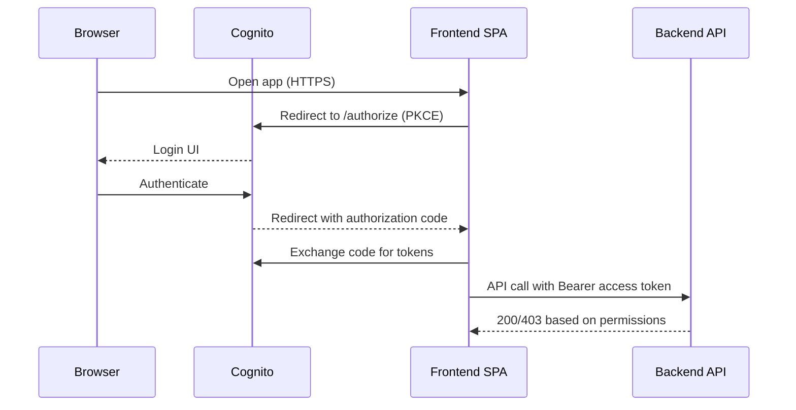
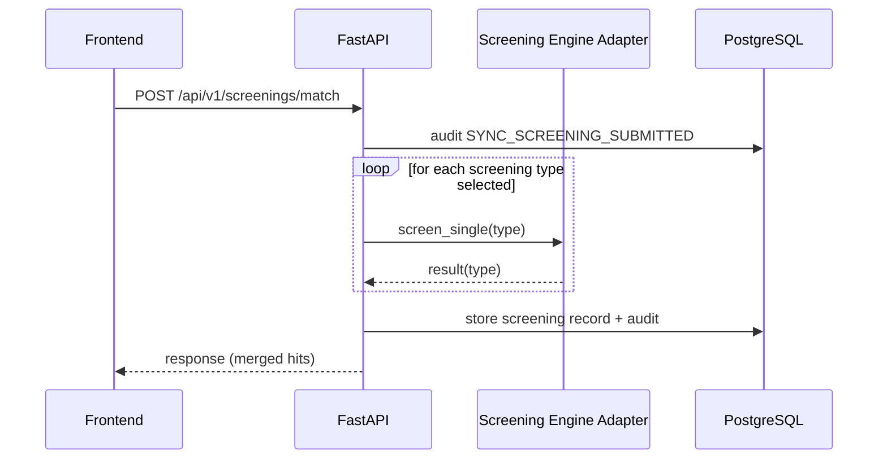
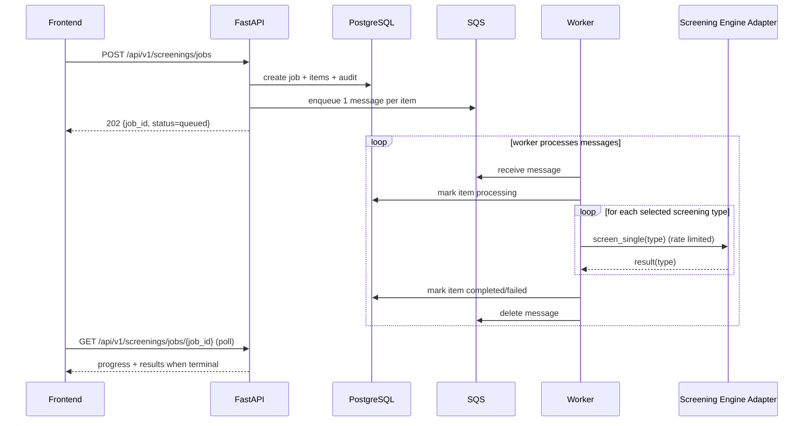
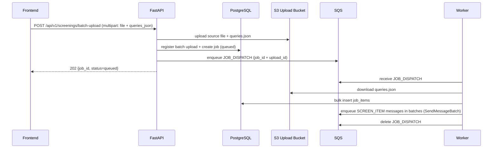
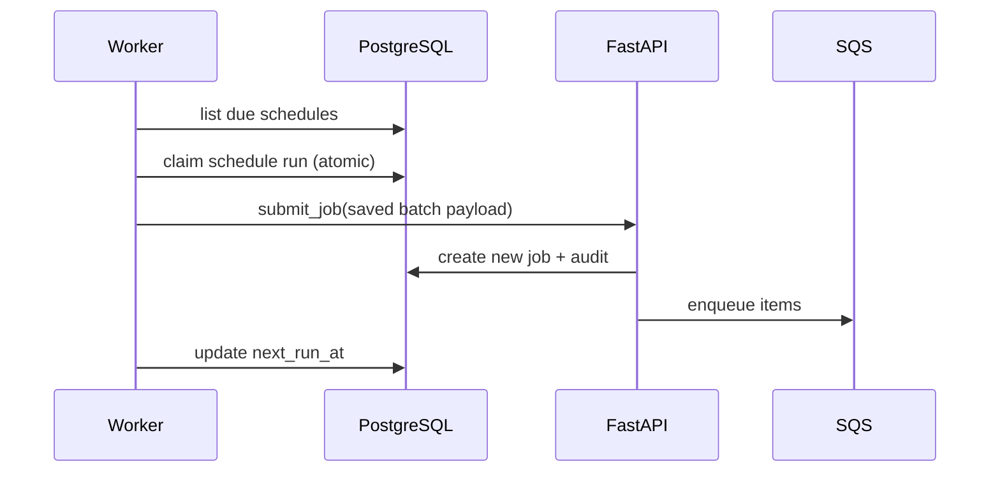
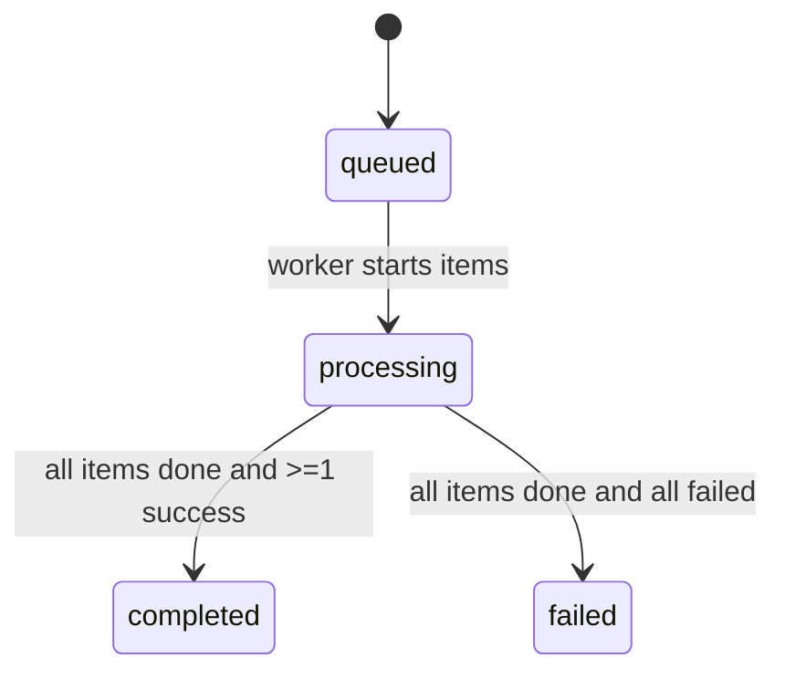
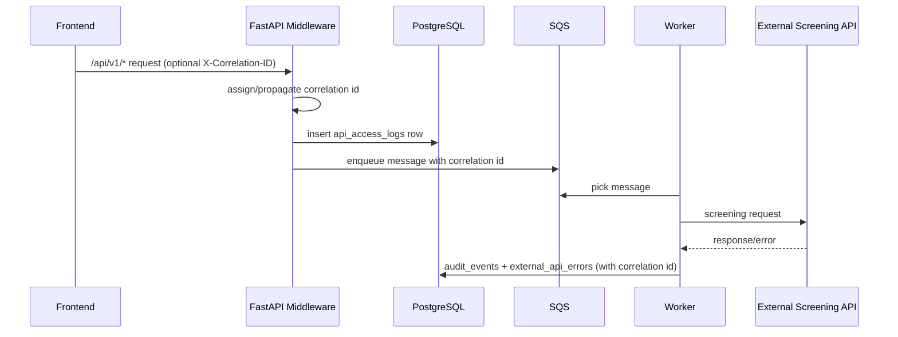

# Technical Design Document (TDD): OFAC / Watchlist Screening Platform

**Version:** 1.2  
**Date:** 2026-03-08  
**Repo:** `ofac-screening-aws`  

This document describes the technical design for the OFAC / watchlist screening platform deployed on AWS. It includes AWS architecture, API flows, process flows, and component responsibilities.

## 1. System Overview

The platform supports:
- **Single Screening (Sync):** user submits a single entity and receives an immediate response.
- **Batch Screening (Async):** user uploads a batch; the platform returns immediately with a job id; a worker processes in background.
- **Large Batch Dispatch (Async):** for very large immediate batch uploads, backend stores `queries.json` in S3 and enqueues a `JOB_DISPATCH` SQS message so the worker can expand/enqueue per-record tasks without hitting CloudFront origin timeouts.
- **Daily Screening (Scheduled):** selected batches are automatically re-screened daily shortly after midnight Eastern time.
- **AuthN/AuthZ:** OIDC login (AWS Cognito or enterprise IdP federation) and role-based authorization.
- **Audit Trail:** all key user/system actions are recorded for traceability.
- **API Access Logging:** every `/api/v1/*` request is logged with status, latency, auth state, and correlation id.
- **Operational Controls:** log retention and high-risk external API failure alerting.

## 2. AWS Architecture (Deployed View)

### 2.1 Logical Diagram

```mermaid
flowchart LR
  subgraph Internet[Public Internet]
    U[User Browser]
  end

  subgraph AWS[AWS Account]
    CF[CloudFront Distribution<br/>HTTPS]
    ALB[Application Load Balancer<br/>HTTP origin from CloudFront]

  subgraph VPC[VPC]
      subgraph ECS[ECS Cluster: Screening]
        FE[Frontend Service<br/>Fargate Task<br/>Nginx + SPA]
        BE[Backend Service<br/>Fargate Task<br/>FastAPI]
        WK[Worker Service<br/>Fargate Task<br/>SQS consumer + scheduler]
      end

      SD[Service Discovery (Cloud Map)<br/>Namespace: screening.internal<br/>backend.screening.internal]
      Q[SQS Queue<br/>screening-requests]
      DB[(RDS PostgreSQL)]
      CW[CloudWatch Logs]
    end

    COG[AWS Cognito User Pool<br/>OIDC]
    S3[(S3 Bucket<br/>Batch Upload Storage)]
    SNS[SNS<br/>Schedule Notifications]
  end

  U -->|HTTPS| CF
  CF -->|HTTP| ALB
  ALB --> FE

  FE -->|/api/* reverse proxy| BE
  FE --- SD
  BE --- SD

  BE -->|enqueue| Q
  BE -->|read/write| DB
  BE -->|emit logs| CW
  BE -->|upload source + queries.json| S3

  WK -->|poll| Q
  WK -->|read/write| DB
  WK -->|emit logs| CW
  WK -->|download queries.json (JOB_DISPATCH)| S3
  WK -->|publish completion| SNS

  U -->|OIDC Auth Code + PKCE| COG
  U -->|Bearer access token| FE
  FE -->|Bearer access token forwarded| BE
```

### 2.2 Key AWS Components

- **CloudFront**
  - Provides HTTPS required for browser crypto APIs (OIDC PKCE) and a single public entrypoint.
  - Origin is the public ALB.
- **ALB**
  - Routes traffic to the frontend service target group.
  - Backend traffic stays internal: the frontend Nginx reverse-proxies `/api/` to the backend service name.
- **ECS/Fargate**
  - `ofac-screening-frontend-svc`: serves SPA + reverse proxy.
  - `ofac-screening-backend-svc`: FastAPI REST API and synchronous screening.
  - `ofac-screening-worker-svc`: consumes SQS and runs daily schedule loop (often desired count 0 in dev to reduce cost).
- **Cloud Map service discovery**
  - Backend resolves as `backend.screening.internal` from the frontend tasks.
- **SQS**
  - Buffers batch work; decouples user submission from screening execution.
- **RDS PostgreSQL**
  - Stores jobs, items, daily schedule definitions and run metadata, and audit events.
- **Cognito**
  - User login and token issuance (or federation from enterprise IdP).
  - Group membership in tokens maps to app roles/permissions.
- **S3 (optional, required for large batch dispatch)**
  - Stores batch upload source files (XLSX) and `queries.json` when enabled.
  - Large immediate uploads use S3-backed `JOB_DISPATCH` expansion to avoid CloudFront timeouts.
- **SNS (optional)**
  - Publishes scheduled screening completion notifications to subscribed email recipients (implementation uses per-recipient SNS topics to avoid repeated email confirmation prompts when schedules change).
- **CloudWatch Logs**
  - Central log streams per ECS service for support and troubleshooting.

## 3. Security Design

### 3.1 Authentication

- Browser uses **OIDC Authorization Code + PKCE** against Cognito.
- Frontend stores session per configuration (session storage supported for tab-close logout behavior).
- Frontend sends `Authorization: Bearer <access_token>` with API requests.

### 3.2 Authorization Model

Roles are derived from token claims (e.g., Cognito `cognito:groups`, or `custom:roles` if federating).

Role intent:
- `viewer`: can perform screening only in mock mode.
- `analyst`: can do single + batch screening.
- `compliance`: analyst permissions + daily screening enable/disable.
- `admin`: compliance permissions + user admin + audit visibility.

Backend enforces permissions per endpoint (scope/role checks).

### 3.3 Token Validation

Backend validates JWT signature using JWKS and checks:
- issuer matches configured issuer
- algorithm matches allowed list
- audience compatibility for Cognito access tokens:
  - accept app client id in `aud` OR `client_id` OR `azp`

Auth audit behavior:
- API 401/403 outcomes are written to `audit_events` and `api_access_logs`.
- Identity-provider login attempts (hosted by Cognito/enterprise IdP) remain in IdP-native audit logs; this app records API-layer authentication outcomes.

## 4. Component Responsibilities

### 4.1 Frontend (SPA + Nginx reverse proxy)

Responsibilities:
- Provide UI for Single/Batch/Daily screening and results.
- Initiate OIDC login/logout and maintain session.
- Call backend APIs under `/api/v1/*`.
- Poll job progress for batch screening and render status transitions.
- Enforce UX constraints based on user permissions (hide/disable actions).

Runtime configuration:
- `VITE_*` values are injected at container startup into `app-config.js`.
- Nginx config is generated at startup; `/api/` is reverse-proxied to `BACKEND_UPSTREAM`.

### 4.2 Backend API (FastAPI)

Responsibilities:
- Validate and accept screening requests.
- Provide synchronous screening endpoint for immediate results.
- Create batch jobs and enqueue SQS messages for async processing.
- For immediate large batch uploads, create the job quickly and enqueue a single `JOB_DISPATCH` message; the worker expands into per-record `SCREEN_ITEM` tasks using `queries.json` stored in S3.
- Provide job progress endpoints for polling.
- Manage daily schedule definitions (list/disable).
- Write audit events for key actions and failures.
- Run middleware-based API access logging (method/path/status/latency/user/auth state).
- Generate and return request correlation id (`X-Correlation-ID`) and propagate to downstream screening flows.

### 4.3 Worker (SQS Consumer + Daily Scheduler Loop)

Responsibilities:
- Poll SQS messages and process screening items.
- Handle `JOB_DISPATCH` messages for large immediate batch uploads by downloading `queries.json` from S3, creating job items in bulk, and enqueuing per-record `SCREEN_ITEM` tasks using `SendMessageBatch` (10 at a time).
- Enforce screening throughput and execute screening calls for selected types.
- Enforce throughput constraint via fixed-rate limiter (`32 TPS`).
- Persist item results (completed/failed) into the database.
- Periodically check due daily schedules and trigger new batch jobs.
- Apply retention policy cleanup for audit/access/error stores.
- Emit high-risk audit alerts when external API failures exceed configured threshold/window.

### 4.4 Screening Engine Adapter (Actimize Watchlist Adapter)

Responsibilities:
- Provide `screen_single` and `screen_many_types`.
- Normalize results into a stable structure for UI consumption.
- Support mock screening for demos/dev environments.

Note: In this repo, the adapter is configured for the Actimize/Kong sanctions API and preserves the "single-type per request" behavior required by Actimize-style engines.

### 4.5 Data Store (PostgreSQL)

Responsibilities:
- Persist job metadata, per-item status transitions, request payloads, and response payloads.
- Persist daily schedules and next-run calculations.
- Persist audit events for compliance and troubleshooting.
- Persist API access logs (`api_access_logs`) for request/response traceability.
- Persist external API failures (`external_api_errors`) with provider/operation context.

## 5. Data Model (Business Objects)

### 5.1 Screening Types

- `Sanction`
- `PEP`
- `AME`
- `Fincen 314(a)`
- `Global Sanction`

### 5.2 Entity Types

- `Individual`
- `Organization`
- `Vessel`
- `Aircraft`

### 5.3 Job Status (Batch)

- `queued`
- `processing`
- `completed`
- `failed`

Item status is tracked similarly and rolls up to job snapshot counts.

### 5.4 Audit and Access Objects

- `audit_events`
  - Business and system action trail (screening submit, queue lifecycle, schedule actions, auth failures, alert events).
- `api_access_logs`
  - One row per `/api/v1/*` request including method, path, status, duration, user context, auth state, and correlation id.
- `external_api_errors`
  - Error repository for upstream screening API failures with provider, endpoint, status code, and request context.

## 6. API Design

Base path: `/api/v1` (except health endpoint).

### 6.1 Cross-Cutting API Behavior

- AuthN/AuthZ:
  - `/api/v1/*` uses bearer JWT validation when `AUTH_ENABLED=true`.
  - Authorization uses role/scopes with permissions (`screening.read`, `screening.write`, `screening.daily`, `screening.admin`, `screening.useradmin`, `screening.single.mock`).
- Correlation and access audit:
  - Every API response includes `X-Correlation-ID`.
  - Every `/api/v1/*` request is written to `api_access_logs` with method, path, status, latency, auth state, and user context.
  - 401/403 outcomes emit audit events (`API_AUTHENTICATION_FAILED`, `API_AUTHORIZATION_FAILED`).
- Screening guardrails:
  - Business Unit is mandatory for screening submissions and is validated against user mapping.
  - Sync screening allows viewer role only in `mock_screening=true`.
  - Daily/scheduled operations require compliance/admin permission.
- Error handling:
  - Validation/business rule failures return `400`.
  - Authorization failures return `403`.
  - Missing entities return `404`.
  - External screening API failures are persisted to `external_api_errors`.

### 6.2 Endpoint Catalog

| Method | Path | Required Permission | Functionality |
|---|---|---|---|
| `GET` | `/health` | None | Liveness/readiness response (`{"status":"ok"}`). |
| `POST` | `/api/v1/screenings/jobs` | `screening.write` or `screening.daily` or `screening.admin` | Creates async screening job from JSON payload (`queries`, screening types, schedule options). If `daily_screening=true`, schedule is created/updated and first execution is deferred to schedule time. |
| `POST` | `/api/v1/screenings/batch-upload` | `screening.write` or `screening.daily` or `screening.admin` | Uploads batch file + query payload, validates file content rules, optionally stores source in S3. For scheduled/daily runs, creates job/schedule. For immediate large runs, requires S3 upload enabled and enqueues a `JOB_DISPATCH` message so the worker can expand/enqueue per-record tasks without request timeouts. Supports optional subscription creation for schedules. |
| `GET` | `/api/v1/screenings/jobs/{job_id}` | `screening.read` | Returns job progress counts and terminal responses when complete. |
| `GET` | `/api/v1/screenings/submissions` | `screening.read` | Returns user-visible submission history for single and batch runs with normalized result status. |
| `POST` | `/api/v1/screenings/match` | `screening.write` or `screening.single.mock` or `screening.admin` | Performs synchronous screening, persists job/item metadata, returns immediate merged results; logs per-item API call success/failure. |
| `GET` | `/api/v1/screenings/daily-schedules` | `screening.read` | Lists active schedules with frequency, next run, source file metadata, and business unit. |
| `DELETE` | `/api/v1/screenings/daily-schedules/{schedule_id}` | `screening.daily` or `screening.admin` | Disables one daily schedule and writes audit event. |
| `GET` | `/api/v1/screenings/daily-schedules/{schedule_id}/subscriptions` | `screening.read` | Lists subscriptions for a schedule (scoped to caller context). |
| `POST` | `/api/v1/screenings/daily-schedules/{schedule_id}/subscriptions` | `screening.read` | Upserts subscription email for schedule notifications. |
| `DELETE` | `/api/v1/screenings/daily-schedules/{schedule_id}/subscriptions` | `screening.read` | Removes subscription by email for the schedule. |
| `GET` | `/api/v1/business-units` | `screening.read` | Returns active business units mapped to current user. |
| `GET` | `/api/v1/admin/business-units` | `screening.admin` or `screening.useradmin` | Lists all business units (`include_inactive` supported). |
| `POST` | `/api/v1/admin/business-units` | `screening.admin` or `screening.useradmin` | Creates new business unit reference row. |
| `PUT` | `/api/v1/admin/business-units/{business_unit_code}` | `screening.admin` or `screening.useradmin` | Updates business unit code/name and cascades code change to mappings/metadata. |
| `DELETE` | `/api/v1/admin/business-units/{business_unit_code}` | `screening.admin` or `screening.useradmin` | Deletes business unit and related user mappings. |
| `GET` | `/api/v1/admin/business-unit-mappings` | `screening.admin` or `screening.useradmin` | Lists user-to-business-unit mappings. |
| `PUT` | `/api/v1/admin/business-unit-mappings/{user_id}` | `screening.admin` or `screening.useradmin` | Replaces mapping for one user with supplied business unit list. |
| `GET` | `/api/v1/admin/users` | `screening.admin` or `screening.useradmin` | Lists known users (DB + Cognito user pool enumeration fallback). |
| `GET` | `/api/v1/audit-events` | `screening.admin` or `screening.useradmin` | Returns audit events with pagination (`limit`, `offset`) and optional `user_id` filter. |

### 6.3 Functional Notes By API Area

- Screening submission APIs:
  - Persist job, item, metadata, and audit records.
  - Async jobs enqueue either per-item `SCREEN_ITEM` work (JSON submit) or a single `JOB_DISPATCH` work item (large batch upload) which expands into per-item work in the worker.
  - Sync jobs execute immediately and write per-item external API call audit lifecycle.
- Batch-upload validation:
  - `queries_json` must be non-empty object.
  - `PartyKey` is required, cannot be blank, and must be unique.
  - Legacy `row_<n>` keys are rejected.
  - Allowed schema values: person/individual/company/organization/legalentity/unknown.
  - Gender validation allows `M`, `F`, or blank (plus textual male/female/unknown variants).
  - At least one non-empty name is required.
- Scheduling and subscriptions:
  - Schedule creation does not screen immediately; worker executes at `next_run_at`.
  - Schedule runs support frequency (`DAILY`, `WEEKLY`, `MONTHLY`) and dedupe against previously screened schedule record hashes.
  - Completion notifications are generated for subscribed emails and logged.
- Admin APIs:
  - Business unit reference table is runtime-managed via API (create/update/delete/list).
  - User/business-unit mapping determines selectable BU values in screening flows and is enforced on submit.
- Audit APIs:
  - `audit_events` is admin-only.
  - Additional operational telemetry is stored in `api_access_logs` and `external_api_errors` tables for enterprise support/compliance queries.

### 6.4 Canonical Schemas (Selected)

#### `MatchJobRequest` (`POST /api/v1/screenings/jobs`)

```json
{
  "queries": {
    "P001": {
      "schema": "person",
      "properties": {
        "partyKey": "P001",
        "name": ["Jane Doe"],
        "birthDate": "1980-01-01",
        "gender": "F"
      }
    }
  },
  "screening_types": ["Sanction", "PEP"],
  "mock_screening": false,
  "business_unit_code": "AML",
  "daily_screening": false,
  "schedule_frequency": "DAILY",
  "schedule_run_at": null,
  "schedule_id": null,
  "batch_name": "Example Batch"
}
```

#### `MatchJobAccepted` (`202` from `POST /api/v1/screenings/jobs`)

```json
{
  "job_id": "6a2bb3b7-6a2f-4c6b-9f4a-3c82e7c4f2ad",
  "status": "QUEUED",
  "submitted_at": "2026-03-08T21:12:33.123456+00:00",
  "total_items": 1,
  "business_unit_code": "AML",
  "daily_schedule_id": null,
  "screened_item_keys": []
}
```

#### `Batch Upload` (`POST /api/v1/screenings/batch-upload` multipart)

- `file`: uploaded XLSX (required)
- `queries_json`: JSON string containing `{ "<PartyKey>": { "schema": "...", "properties": {...} }, ... }` (required)
- `screening_types_json`: JSON string array (default `[]`)
- `business_unit_code`: string (required)
- Optional scheduling: `daily_screening`, `schedule_frequency`, `schedule_run_at`, `schedule_id`
- Optional behavior: `mock_screening`, `batch_name`, `subscribe_results`, `subscribe_email`, `subscribe_emails`

#### `ScreeningQueueMessage` (SQS body)

- `message_type="SCREEN_ITEM"` (default): carries one record (`item_key` + `query`).
- `message_type="JOB_DISPATCH"`: control message used by large batch uploads (must omit `query`; may omit `item_key`); worker downloads `queries.json` from S3 and expands into `SCREEN_ITEM` messages.

## 7. Process Flows

### 7.1 OIDC Login (Cognito)



### 7.2 Single Screening (Sync)



### 7.3 Batch Screening (Async - JSON Submit)



### 7.3.1 Batch Upload (Async - Large Batch Dispatch)



### 7.4 Daily Screening Trigger (Worker Scheduler)



### 7.5 Batch Job Status Rollup



### 7.6 Correlation and Access Audit Flow



## 8. Operational Design

### 8.1 Throughput and Rate Limiting

- Worker enforces a fixed-rate schedule for outbound screening calls.
- Default is `32 TPS` across the worker process.

### 8.2 Resilience and Retries

- Worker marks failures per item; job can still complete with partial failures.
- Messages are deleted after processing to avoid duplicates (at-least-once queue semantics should be accounted for by idempotent writes).
- Daily schedule trigger uses a claim step to reduce duplicate schedule runs.

### 8.3 Observability

- Application logs shipped to CloudWatch via ECS log driver.
- Audit events provide a business-level trail, separate from system logs.
- API access logs provide request-level traceability with latency and auth state.
- Correlation id is propagated to queue/worker/external error records for end-to-end troubleshooting.

### 8.4 Data Retention and Risk Alerting

- Worker executes periodic retention cleanup for:
  - `audit_events`
  - `api_access_logs`
  - `external_api_errors`
- Retention windows are configurable with environment variables.
- High-risk alerting rule:
  - If external API failures exceed configured threshold inside configured time window, worker records `HIGH_RISK_EXTERNAL_API_FAILURE_ALERT` in `audit_events`.
- Access-log query parameters are redacted for sensitive key types (token/secret/password/email-like fields).

### 8.5 Cost Controls (Dev)

- Keep worker desired count at `0` when not testing batch/daily.
- Use small Fargate tasks (256/512) for dev.
- Use minimal RDS instance for dev and stop when not needed (per environment policy).

## 9. Deployment Artifacts

- ECS task definitions in `deploy/ecs/`
  - `frontend-task-definition.json`
  - `backend-task-definition.json`
  - `worker-task-definition.json`
- CloudFront distribution config example in `deploy/cloudfront-distribution-config.json`

## 10. Appendix: Runtime Configuration

### 10.1 Frontend (container env)

Key values:
- `BACKEND_UPSTREAM` (example: `http://backend.screening.internal:8000`)
- `VITE_SCREENING_API_BASE_URL` (default: `/api/v1`)
- `VITE_AUTH_ENABLED` / OIDC settings

### 10.2 Backend/Worker (container env)

Key values:
- `APP_DB_URL` (PostgreSQL connection string)
- `AWS_SQS_QUEUE_NAME`
- `AUTH_ENABLED`, `AUTH_ISSUER`, `AUTH_JWKS_URL`, `AUTH_AUDIENCE`
- `SCREENING_TPS`
- `AUDIT_ACCESS_LOG_ENABLED` (default `true`)
- `AUDIT_EVENT_RETENTION_DAYS` (default `3650`)
- `API_ACCESS_LOG_RETENTION_DAYS` (default `365`)
- `EXTERNAL_API_ERROR_RETENTION_DAYS` (default `365`)
- `OPERATIONAL_CLEANUP_INTERVAL_S` (default `3600`)
- `HIGH_RISK_EXTERNAL_API_ERROR_WINDOW_MINUTES` (default `15`)
- `HIGH_RISK_EXTERNAL_API_ERROR_THRESHOLD` (default `10`)

## 11. Appendix: Batch File -> Actimize Request Mapping

This section documents how fields from the uploaded batch file (CSV/XLSX) map into:
1) the backend `queries_json` payload (`EntityExample` objects) and
2) the Actimize `POST /entity-screenings` JSON payload.

### 11.1 Batch File Format and Header Rules

- Supported uploads: `.csv`, `.xlsx`, `.xls`.
- Excel parsing uses the **first worksheet** only (e.g., the template sheet named `Template`).
- Column header matching is **case-insensitive** and tolerant of separators:
  - headers are normalized by lowercasing and removing non-alphanumeric characters
  - example: `Party Key`, `party_key`, and `PartyKey` all map to the same field.
- Reference template: `public/Actimize_SSB1_template.xlsx`.

### 11.2 Column Mapping to `queries_json` (`EntityExample`)

Batch rows are parsed in the frontend (`src/utils/batchParse.ts`) and converted into `queries_json` (`src/screens/ScreeningDetailPage.tsx`).
The backend treats the `PartyKey` as the canonical record identifier and ensures it is propagated into the downstream screening request.

| Batch File Column (template) | Parsed Field | `queries_json` (`EntityExample`) | Notes |
|---|---|---|---|
| `PartyKey` | `partyKey` | **Object key**: `queries["<PartyKey>"]` | Required and must be unique within the file; backend also injects this into `properties.partyKey` for traceability. |
| `PartyType` (`I`/`E`) | `partyType` | `schema` | `I` -> `schema="Person"`; `E` -> `schema="Company"`. If missing, UI infers from `CustomerType` and/or available name fields. |
| `CustomerType` (`Person`/`Entity`) | `customerType` | `schema` | Used as a fallback when `PartyType` is missing. |
| `PrimaryFirstName` | `firstName` | `properties.name[]` | Individual only: combined with middle/last to form a primary name string. |
| `PrimaryMiddleName` | `middleName` | `properties.name[]` | Included in the combined primary name string when present. |
| `PrimaryLastName` | `lastName` | `properties.name[]` | Individual only: required (with First Name) if `PrimaryFullName` is not provided. |
| `PrimaryFullName` | `fullName` | `properties.name[]` | Required for Organization/Unknown; for Individual it can be used instead of split names. |
| `Alias1FullName` | `aliasName` | `properties.alias[]` | Optional; sent as a single alias entry. |
| `DateOfBirth` | `dateOfBirth` | `properties.birthDate[]` | Individual only. Accepted as `YYYY-MM-DD`, `YYYY/MM/DD`, `DD/MM/YYYY`, `DD-MM-YYYY`, or `YYYY` (year-only). |
| `Gender` | `gender` | *(not mapped)* | Validated as `M`, `F`, or blank, but **not currently forwarded** to `queries_json` or Actimize payload. |
| `Addresses` | `addresses` | `properties.address[]` | Optional comma-separated list of full-address lines. If blank, UI derives a one-line address from `Address1*` fields. |
| `Address1Line1` | `addressLine1` | `properties.address[]` | Used only when `Addresses` is blank (part of derived one-line address). |
| `Address1Line2` | `addressLine2` | `properties.address[]` | Used only when `Addresses` is blank (part of derived one-line address). |
| `Address1City` | `city` | `properties.address[]` | Used only when `Addresses` is blank (part of derived one-line address). |
| `Address1StateProvince` | `state` | `properties.address[]` | Used only when `Addresses` is blank (part of derived one-line address). |
| `Address1ZipCode` | `zip` | `properties.address[]` | Used only when `Addresses` is blank (part of derived one-line address). |
| `Countries` | `countries` | `properties.nationality[]` or `properties.country[]` | Optional comma-separated list. Prefer ISO2 country codes (e.g., `US`, `IN`). |
| `Address1Country` | `country` | `properties.nationality[]` or `properties.country[]` | Used as a fallback country when `Countries` is blank. |
| `NationalityCountry1` | `countryOfCitizenship` | `properties.nationality[]` or `properties.country[]` | Added to the country set; UI uses nationality for persons and country for organizations. |
| `CountryOfBirth` | `countryOfBirth` | *(not mapped)* | Parsed but **not currently forwarded** to `queries_json` or Actimize payload. |
| `PartyId1Value` | `idNumber` | `properties.idNumber[]` (Person) or `properties.registrationNumber[]` (Company) | Optional. Only the ID value is forwarded. |
| `PartyId1Type` | `idType` | *(not mapped)* | Parsed but **not currently forwarded**; Actimize adapter uses a default (`PASSPORT` for persons, `TIN` for entities). |
| `PartyId1IDCountry` | `idCountry` | *(not mapped)* | Parsed but **not currently forwarded**; Actimize adapter uses the first mapped country (if available). |
| `Notes` | *(none)* | *(not mapped)* | Ignored. |

### 11.3 Mapping from `queries_json` (`EntityExample`) to Actimize `POST /entity-screenings`

Actimize screening is performed by the backend adapter (`backend/app/actimize.py`) which posts to:

- `POST ${ACTIMIZE_BASE_URL}/entity-screenings`

The JSON payload is derived from `EntityExample` roughly as follows:

| `EntityExample` Field | Actimize JSON Field | Notes |
|---|---|---|
| `properties.partyKey` (or derived) | `partyKey` | Backend ensures `partyKey` is present for batch items; otherwise a deterministic hash-based key is generated. |
| `schema` | `partyType` | `Person`/`Individual` -> `I`; `Company`/`Organization`/`Unknown` -> `E`. |
| `properties.name[0]` | `names.fullName` | For `partyType="I"`, `firstName`/`lastName` are derived by splitting the full name if not explicitly provided. |
| `properties.alias[]` (+ additional names) | `aliases[]` | Up to 10 unique aliases; for persons, alias `firstName`/`lastName` are also derived by splitting. |
| `properties.nationality[]` / `properties.country[]` | `nationalities[]` | Converted to ISO3 (supports ISO2 or ISO3 input); up to 5 entries. |
| `properties.address[]` | `addresses[]` | Mapped as `street1` plus default `country` (first mapped nationality/country); up to 5 entries. |
| `properties.idNumber[]` / `properties.registrationNumber[]` | `ids[]` | Sent as `{idType, idValue, idCountry}` with defaults and first mapped country; up to 5 entries. |
| `properties.birthDate[]` | `dateOfBirth` or `yearOfBirth` | Dates normalize to `DD/MM/YYYY` when possible; year-only populates `yearOfBirth`. |
