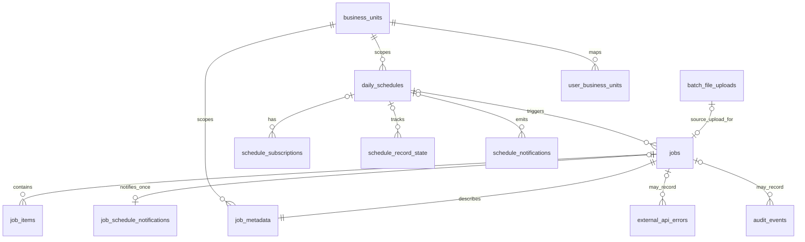
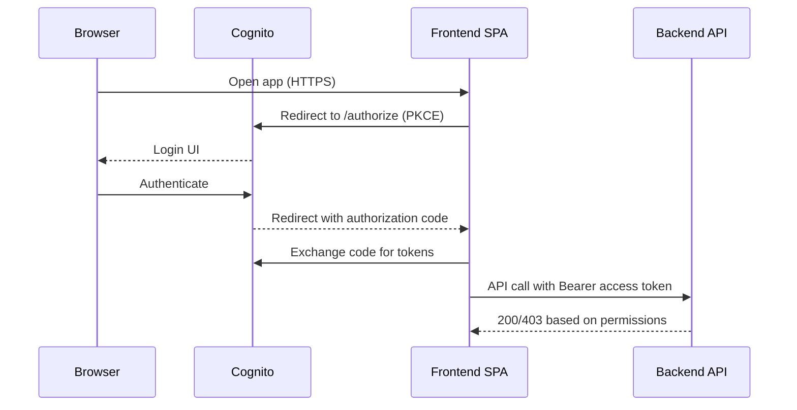
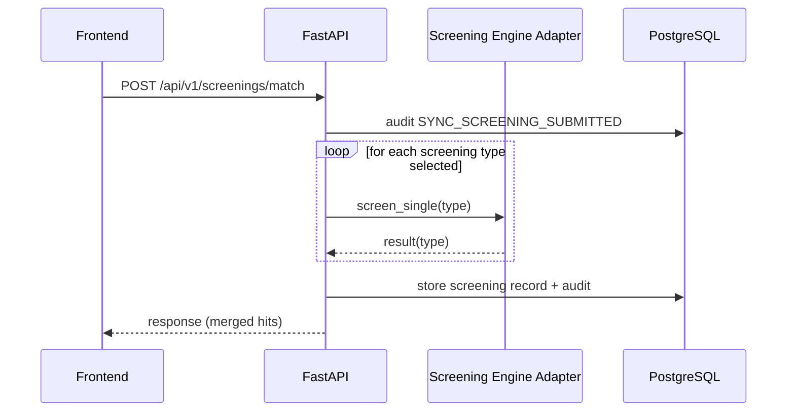
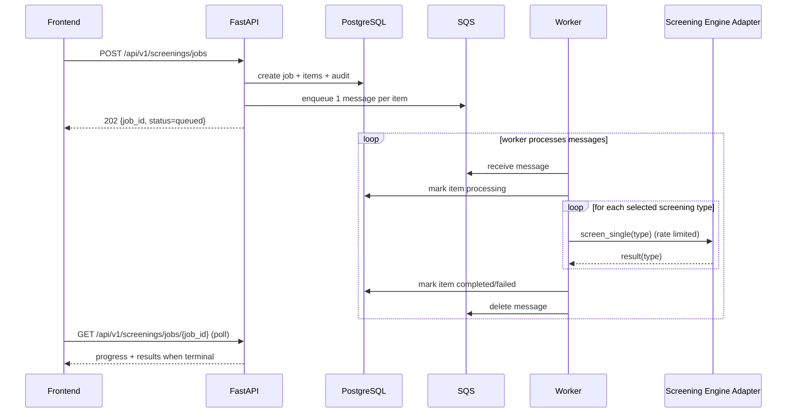
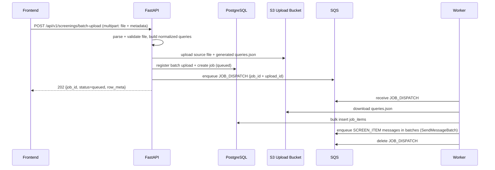
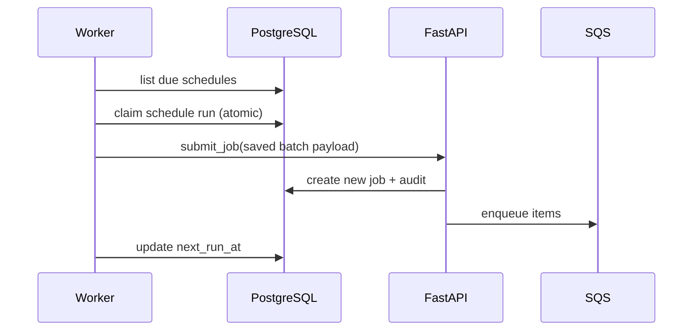
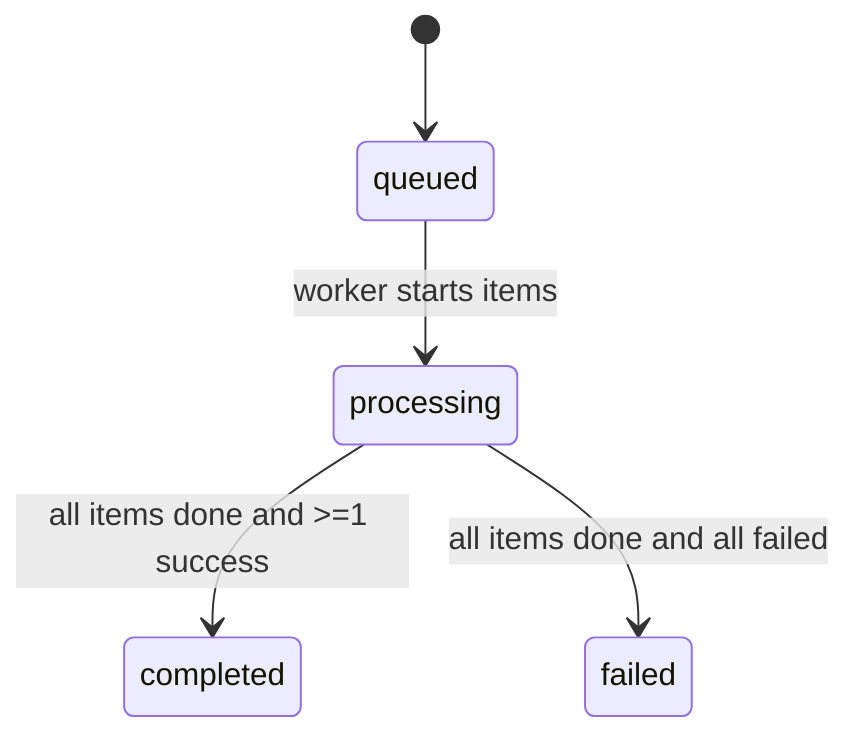
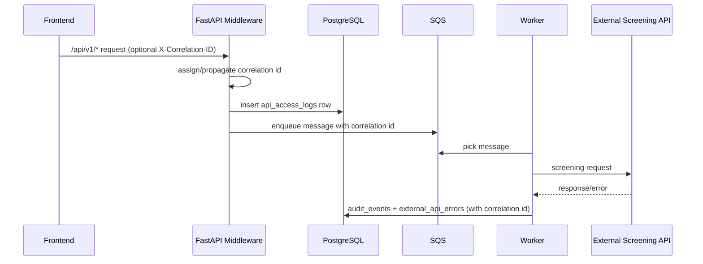

# Technical Design Document (TDD): OFAC / Watchlist Screening Platform

**Version:** 1.9  
**Date:** 2026-05-06  
**Repo:** `ofac-screening-aws`  

This document describes the technical design for the OFAC / watchlist screening platform deployed on AWS. It includes AWS architecture, API flows, process flows, and component responsibilities.

## Revision Summary

- Batch upload is now fully **backend-parsed**: the frontend submits only the source file plus metadata, and the backend validates/normalizes rows into `EntityExample` payloads before job creation.
- The batch upload response now returns `row_meta` so the UI can render placeholder/result rows without duplicating client-side parsing logic.
- The screening dashboard is split into two backend APIs:
  - `GET /api/v1/screenings/summary` for full-history aggregate cards
  - `GET /api/v1/screenings/results` for newest-first normalized result rows (`limit` query parameter, default `1000`, max `5000`)
- The TDD now explicitly documents the browser/API trust boundary: frontend calls only the backend container for application APIs, while the worker remains SQS-driven with no browser-facing API.
- Large immediate uploads continue to use the S3-backed `JOB_DISPATCH` pattern so the worker expands queued work asynchronously instead of performing per-record dispatch in the request thread.
- Audit operations now support paged admin retrieval, and raw Actimize/Prudential request/response troubleshooting logs can be enabled with redaction.
- Authentication wording is aligned to the current AWS deployment baseline: OIDC via AWS Cognito (with optional enterprise federation), with old local Keycloak references removed from the active design baseline.
- Worker-side transient external API hardening now includes delayed SQS requeue for retryable upstream failures (`429/500/502/503/504`) with bounded exponential backoff, per-item retry-attempt tracking, and explicit audit events for successful requeue vs requeue failure.
- Actimize request mapping is now explicit for person-name parts end-to-end: `firstName`/`middleName`/`lastName`/`maidenName` are preserved as dedicated fields (not derived from `fullName`) for single and batch flows.
- Batch parser now preserves structured alias fields (`Alias1*`/`Alias2*`/`Alias3*`) into `properties.aliases[]` so Actimize receives split alias names when provided.
- Screening definition (`screeningType`) mapping is fully database-driven via `actimize_screening_type_mappings`; code no longer applies hardcoded screening-type fallback mappings.
- PostgreSQL dashboard/result retrieval is now backed by materialized views (`mv_user_recent_results`, `mv_user_result_summary_counts`) with periodic best-effort refresh in runtime.
- Recent-result rows now normalize/canonicalize `screeningType` labels using active mapping table values (`screening_type`, `search_definition_id`, `search_definition_name`) for consistent UI grouping.

## 1. System Overview

The platform supports:
- **Single Screening (Sync):** user submits a single entity and receives an immediate response.
- **Batch Screening (Async):** user uploads a CSV/XLSX file plus metadata only; the backend parses, validates, and normalizes the file before creating async work.
- **Large Batch Dispatch (Async):** for very large immediate batch uploads, backend stores the uploaded source file and a backend-generated `queries.json` in S3 and enqueues a `JOB_DISPATCH` SQS message so the worker can expand/enqueue per-record tasks without hitting CloudFront origin timeouts.
- **Daily Screening (Scheduled):** selected batches are automatically re-screened on their configured cadence (`DAILY`, `WEEKLY`, `MONTHLY`) shortly after the configured local run time.
- **AuthN/AuthZ:** OIDC login (AWS Cognito or enterprise IdP federation) and role-based authorization.
- **Audit Trail:** key user/system actions are recorded for traceability, with admin-facing paged audit APIs.
- **Fast Screening Dashboard:** summary cards load from a dedicated aggregate API over full user history, while the Screening Results grid loads a separate newest-first feed with caller-defined `limit` (backend default `1000`, max `5000`).
- **API Access Logging:** every `/api/v1/*` request is logged with status, latency, auth state, and correlation id.
- **Raw Upstream Troubleshooting Logs:** outbound Prudential/Actimize request and response payloads are logged to CloudWatch with sensitive fields redacted.
- **Operational Controls:** explicit schema initialization, connection pooling, DB retry/backoff, retention cleanup, and high-risk external API failure alerting.

## 2. AWS Architecture (Deployed View)

### 2.1 Logical Diagram

```mermaid
flowchart LR
  subgraph Internet[Public Internet]
    U[User Browser]
  end

  subgraph AWS[AWS Account]
    CF[CloudFront Distribution<br/>HTTPS]
    ALB[Application Load Balancer<br/>HTTP origin from CloudFront]

  subgraph VPC[VPC]
      subgraph ECS[ECS Cluster: Screening]
        FE[Frontend Service<br/>Fargate Task<br/>Nginx + SPA]
        BE[Backend Service<br/>Fargate Task<br/>FastAPI]
        WK[Worker Service<br/>Fargate Task<br/>SQS consumer + scheduler]
      end

      SD[Service Discovery (Cloud Map)<br/>Namespace: screening.internal<br/>backend.screening.internal]
      Q[SQS Queue<br/>screening-requests]
      DB[(RDS PostgreSQL)]
      CW[CloudWatch Logs]
    end

    COG[AWS Cognito User Pool<br/>OIDC]
    S3[(S3 Bucket<br/>Batch Upload Storage)]
    SNS[SNS<br/>Schedule Notifications]
  end

  U -->|HTTPS| CF
  CF -->|HTTP| ALB
  ALB --> FE

  FE -->|/api/* reverse proxy| BE
  FE --- SD
  BE --- SD

  BE -->|enqueue| Q
  BE -->|read/write| DB
  BE -->|emit logs| CW
  BE -->|upload source + generated queries.json| S3

  WK -->|poll| Q
  WK -->|read/write| DB
  WK -->|emit logs| CW
  WK -->|download queries.json (JOB_DISPATCH)| S3
  WK -->|publish completion| SNS

  U -->|OIDC Auth Code + PKCE| COG
  U -->|Bearer access token| FE
  FE -->|Bearer access token forwarded| BE
```

### 2.2 Key AWS Components

- **CloudFront**
  - Provides HTTPS required for browser crypto APIs (OIDC PKCE) and a single public entrypoint.
  - Origin is the public ALB.
- **ALB**
  - Routes traffic to the frontend service target group.
  - Backend traffic stays internal: the frontend Nginx reverse-proxies `/api/` to the backend service name.
- **ECS/Fargate**
  - `ofac-screening-frontend-svc`: serves SPA + reverse proxy.
  - `ofac-screening-backend-svc`: FastAPI REST API and synchronous screening.
  - `ofac-screening-worker-svc`: consumes SQS and runs daily schedule loop (often desired count 0 in dev to reduce cost).
- **Cloud Map service discovery**
  - Backend resolves as `backend.screening.internal` from the frontend tasks.
- **SQS**
  - Buffers batch work; decouples user submission from screening execution.
- **RDS PostgreSQL**
  - Stores jobs, items, daily schedule definitions and run metadata, and audit events.
- **Cognito**
  - User login and token issuance (or federation from enterprise IdP).
  - Group membership in tokens maps to app roles/permissions.
- **S3 (optional, required for large batch dispatch)**
  - Stores batch upload source files (`.csv` / `.xlsx`) and backend-generated `queries.json` when enabled.
  - Large immediate uploads use S3-backed `JOB_DISPATCH` expansion to avoid CloudFront timeouts.
- **SNS (optional)**
  - Publishes scheduled screening completion notifications to subscribed email recipients (implementation uses per-recipient SNS topics to avoid repeated email confirmation prompts when schedules change).
- **CloudWatch Logs**
  - Central log streams per ECS service for support and troubleshooting.

## 3. Security Design by Component

### 3.1 Frontend Container Security (`frontend`)

- Browser uses **OIDC Authorization Code + PKCE** against Cognito.
- Frontend stores session per configuration (including session-storage mode for tab-close logout behavior).
- Frontend sends `Authorization: Bearer <access_token>` with API requests.
- Frontend permissions are a UX concern only: buttons/tabs may be hidden or disabled, but enforcement remains in the backend container.
- Frontend does **not** call the worker container directly. All browser API calls terminate at the backend API under `/api/v1/*` and are reverse-proxied by Nginx.

### 3.2 Backend Container Authorization (`backend`)

Roles are derived from token claims (for example Cognito `cognito:groups` or federated custom role claims).

Role intent:
- `viewer`: can perform screening only in mock mode.
- `analyst`: can do single + batch screening.
- `compliance`: analyst permissions + daily screening enable/disable.
- `admin`: compliance permissions + user admin + audit visibility.

Backend enforces permissions per endpoint with scope/role checks.

### 3.3 Backend Token Validation (`backend`)

Backend validates JWT signature using JWKS and checks:
- issuer matches configured issuer
- algorithm matches allowed list
- audience compatibility for Cognito access tokens:
  - accept app client id in `aud` OR `client_id` OR `azp`
- bearer token presence from `Authorization: Bearer <JWT>`
- token expiration and basic claim shape before request processing continues

Auth audit behavior:
- API `401`/`403` outcomes are written to `audit_events` and `api_access_logs`.
- Identity-provider login attempts (hosted by Cognito/enterprise IdP) remain in IdP-native audit logs; this app records API-layer authentication outcomes.

### 3.4 Worker Trust Boundary (`worker`)

- Worker has no browser-facing HTTP API.
- Worker trusts only internal work handed off by the backend through SQS.
- End-user authentication is enforced before work is enqueued; worker authorization is service-to-service and infrastructure-based (ECS task role, SQS access, DB access), not browser-token based.

## 4. Component Responsibilities and Functional Ownership

### 4.1 Frontend (SPA + Nginx reverse proxy)

Responsibilities:
- Provide UI for Single/Batch/Daily screening and results.
- Initiate OIDC login/logout and maintain session.
- Call backend APIs under `/api/v1/*`.
- Poll job progress for batch screening and render status transitions.
- Enforce UX constraints based on user permissions (hide/disable actions).
- Persist screening workspace state and audit-log filter/page state in browser `localStorage`.
- Load dashboard summary counts from `GET /api/v1/screenings/summary` across the full user history.
- Load Screening Results rows from `GET /api/v1/screenings/results` using newest-first pagination with query `limit` (API default `1000`; current frontend caller default `2000`).
- Expose environment-configurable review-alert navigation via `VITE_ACTIMIZE_REVIEW_ALERT_URL`.

Runtime configuration:
- `VITE_*` values are injected at container startup into `app-config.js`.
- Nginx config is generated at startup; `/api/` is reverse-proxied to `BACKEND_UPSTREAM`.

Frontend API boundary:
- Browser -> `frontend` container for static assets and SPA routes
- Browser -> `backend` container for all application API calls via `/api/v1/*`
- Browser -> OIDC provider directly for login/logout/token exchange
- Browser -> `worker` container: none

### 4.2 Backend API (FastAPI)

Responsibilities:
- Validate and accept screening requests.
- Provide synchronous screening endpoint for immediate results.
- Create batch jobs and enqueue SQS messages for async processing.
- Provide a lightweight screening summary API that returns aggregate counts for the signed-in user without loading result rows.
- Provide a lightweight recent-results API that returns newest-first normalized rows for the signed-in user (query `limit`: default `1000`, max `5000`), separated from summary-card aggregation.
- Parse uploaded CSV/XLSX files server-side, validate row rules, normalize them into `EntityExample` payloads, and return `row_meta` for UI rendering.
- For immediate large batch uploads, create the job quickly and enqueue a single `JOB_DISPATCH` message; the worker expands into per-record `SCREEN_ITEM` tasks using backend-generated `queries.json` stored in S3.
- Provide job progress endpoints for polling.
- Manage daily schedule definitions (list/disable).
- Write audit events for key actions and failures.
- Run middleware-based API access logging (method/path/status/latency/user/auth state).
- Generate and return request correlation id (`X-Correlation-ID`) and propagate to downstream screening flows.
- Canonicalize recent-result screening-type labels through active `actimize_screening_type_mappings` so rows group consistently across source/request/response variants.
- Validate database schema at startup, but do not run DDL automatically in runtime API processes.
- Serve as the only browser-facing application API container; no frontend calls bypass backend to reach the worker.

### 4.3 Worker (SQS Consumer + Daily Scheduler Loop)

Responsibilities:
- Poll SQS messages and process screening items.
- Handle `JOB_DISPATCH` messages for large immediate batch uploads by downloading `queries.json` from S3, creating job items in bulk, and enqueuing per-record `SCREEN_ITEM` tasks using `SendMessageBatch` (10 at a time).
- Enforce screening throughput and execute screening calls for selected types.
- Enforce throughput constraint via fixed-rate limiter (`SCREENING_TPS`) and concurrency cap (`SCREENING_PARALLEL_MESSAGES`) per worker task.
- For transient upstream screening failures (`429/500/502/503/504`), requeue the same item with incremented `retry_attempt` and delayed retry using bounded exponential backoff.
- Persist item results (completed/failed) into the database.
- Periodically check due daily schedules and trigger new batch jobs.
- Apply retention policy cleanup for audit/access/error stores.
- Emit high-risk audit alerts when external API failures exceed configured threshold/window.
- Use pooled PostgreSQL connections with retry/backoff for transient DB acquisition failures.
- Emit detailed CloudWatch logs for async screening start/success/failure, including raw external API request/response payloads with redaction.
- Process backend-enqueued work only; it does not expose REST endpoints to the frontend.

### 4.4 Screening Engine Adapter (Actimize Watchlist Adapter)

Responsibilities:
- Provide `screen_single` and `screen_many_types`.
- Normalize results into a stable structure for UI consumption.
- Support mock screening for demos/dev environments.
- Accept Prudential wrapper responses that use either `status_code` or `statusCode`, and unwrap nested `body` payloads before normalization.
- Enforce current Prudential response contract:
  - HTTP `200` + payload `message="PM"` => potential match
  - HTTP `200` + payload `message="NM"` => clear
  - any other payload/status => failure

Note: In this repo, the adapter is configured for the Actimize/Kong sanctions API and preserves the "single-type per request" behavior required by Actimize-style engines.

### 4.5 Data Store (PostgreSQL)

Responsibilities:
- Persist job metadata, per-item status transitions, request payloads, and response payloads.
- Persist daily schedules and next-run calculations.
- Persist audit events for compliance and troubleshooting.
- Persist API access logs (`api_access_logs`) for request/response traceability.
- Persist external API failures (`external_api_errors`) with provider/operation context.
- Persist source-upload metadata (`batch_file_uploads`) and daily schedule dedupe state (`schedule_record_state`).
- Provide derived materialized views for fast per-user result retrieval and aggregate counters (`mv_user_recent_results`, `mv_user_result_summary_counts`).
- Separate schema initialization from runtime by using `python -m app.init_db` during setup/deployment.

## 5. Data Model (Business Objects)

### 5.1 Screening Types

- `Sanction`
- `PEP`
- `AME`
- `Fincen 314(a)`
- `Global Sanction`

### 5.2 Entity Types

- `Individual`
- `Organization`
- `Vessel`
- `Aircraft`

### 5.3 Job Status (Batch)

- `queued`
- `processing`
- `completed`
- `failed`

Item status is tracked similarly and rolls up to job snapshot counts.

### 5.4 Audit and Access Objects

- `audit_events`
  - Business and system action trail (screening submit, queue lifecycle, schedule actions, auth failures, alert events).
- `api_access_logs`
  - One row per `/api/v1/*` request including method, path, status, duration, user context, auth state, and correlation id.
- `external_api_errors`
  - Error repository for upstream screening API failures with provider, endpoint, status code, and request context.

### 5.5 Database Design Diagram



### 5.6 Table Names, Structure, and Use Case

#### `jobs`

- Primary key: `job_id`
- Core columns: `status`, `created_at`, `updated_at`, `total_items`, `source_schedule_id`, `source_upload_id`, `user_id`, `user_name`
- Use case: top-level execution container for sync, batch, and scheduled screening runs

#### `job_items`

- Primary key: `(job_id, item_key)`
- Core columns: `request_json`, `response_json`, `status`, `error_text`, `updated_at`
- Use case: per-record screening state and normalized response storage

#### `job_metadata`

- Primary key: `job_id`
- Core columns: `mode`, `screening_types_json`, `mock_screening`, `batch_name`, `file_name`, `daily_screening`, `schedule_frequency`, `daily_schedule_id`, `query_count`, `deferred_until`, `business_unit_code`
- Use case: UI/history metadata for jobs that does not belong in the execution counter table

#### `daily_schedules`

- Primary key: `schedule_id`
- Core columns: `batch_name`, `user_id`, `user_name`, `queries_json`, `screening_types_json`, `mock_screening`, `schedule_frequency`, `timezone`, `run_hour`, `run_minute`, `created_at`, `last_run_at`, `next_run_at`, `is_active`, `source_upload_id`, `source_file_name`, `source_s3_uri`, `business_unit_code`
- Use case: persisted recurring-screening definitions and next-run state

#### `batch_file_uploads`

- Primary key: `upload_id`
- Core columns: `schedule_id`, `job_id`, `user_id`, `user_name`, `file_name`, `s3_bucket`, `s3_key`, `s3_uri`, `queries_s3_bucket`, `queries_s3_key`, `queries_s3_uri`, `file_hash`, `record_count`, `created_at`, `is_active`
- Use case: traceability for uploaded source files and backend-generated `queries.json`

#### `schedule_record_state`

- Primary key: `(schedule_id, record_hash)`
- Core columns: `first_seen_at`, `last_screened_at`, `last_job_id`
- Use case: dedupe and incremental daily schedule behavior so unchanged records are not rescreened unnecessarily

#### `schedule_subscriptions`

- Primary key: `subscription_id`
- Core columns: `schedule_id`, `user_id`, `user_name`, `email`, `is_active`, `created_at`, `updated_at`
- Use case: scheduled screening completion recipients

#### `job_schedule_notifications`

- Primary key: `job_id`
- Core columns: `schedule_id`, `created_at`
- Use case: idempotency guard so one scheduled job triggers notifications once

#### `schedule_notifications`

- Primary key: `notification_id`
- Core columns: `created_at`, `user_id`, `user_name`, `email`, `schedule_id`, `job_id`, `title`, `message`, `summary_json`
- Use case: notification outbox/audit trail for schedule completion messaging

#### `audit_events`

- Primary key: `event_id`
- Core columns: `created_at`, `user_id`, `user_name`, `action`, `entity_type`, `entity_id`, `details_json`
- Use case: admin/compliance-facing audit trail for screening, auth, and operational actions

#### `api_access_logs`

- Primary key: `access_id`
- Core columns: `created_at`, `correlation_id`, `request_method`, `request_path`, `query_string`, `status_code`, `duration_ms`, `client_ip`, `user_agent`, `user_id`, `user_name`, `auth_state`, `details_json`
- Use case: request-level operational traceability for `/api/v1/*`

#### `external_api_errors`

- Primary key: `error_id`
- Core columns: `created_at`, `provider`, `operation`, `endpoint`, `status_code`, `user_id`, `user_name`, `job_id`, `item_key`, `error_text`, `details_json`
- Use case: upstream screening failure analysis and alerting

#### `business_units`

- Primary key: `business_unit_code`
- Core columns: `business_unit_name`, `is_active`, `created_at`, `updated_at`
- Use case: runtime-managed reference data for business-unit authorization and submission scoping

#### `user_business_units`

- Primary key: `(user_id, business_unit_code)`
- Core columns: `user_name`, `is_active`, `created_at`, `updated_at`
- Use case: user-to-business-unit authorization mapping used by screening submission flows

### 5.7 Derived Materialized Views (PostgreSQL)

#### `mv_user_recent_results`

- Grain: one row per `(job_id, item_key)` for rows with non-empty `jobs.user_id`.
- Core columns: `user_id`, `job_id`, `item_key`, `sort_ts`, `parsed_status`.
- `parsed_status` derivation:
  - `QUEUED`/`PROCESSING` -> `PENDING`
  - explicit failed item status or missing response payload -> `FAILED`
  - response containing `ENGINE_MESSAGE="PM"` -> `POTENTIAL`
  - response containing `ENGINE_MESSAGE="NM"` -> `CLEAR`
  - otherwise -> `CLEAR`
- Indexes:
  - unique `(job_id, item_key)`
  - lookup/sort `(user_id, sort_ts DESC, job_id, item_key)`

#### `mv_user_result_summary_counts`

- Grain: one row per `user_id`.
- Core columns: `total`, `clear`, `potential`, `pending`, `failed`.
- Source: aggregated from `mv_user_recent_results`.
- Index: unique `(user_id)`.

## 6. Backend API Container Design

Base path: `/api/v1` (except health endpoint).

### 6.1 Cross-Cutting API Behavior

Browser-to-container routing model:
- Frontend SPA calls only the `backend` container for application APIs.
- The `worker` container is not part of the browser request path.
- Nginx in the `frontend` container reverse-proxies `/api/*` to the backend service-discovery hostname.

- AuthN/AuthZ:
  - `/api/v1/*` uses bearer JWT validation when `AUTH_ENABLED=true`.
  - Authorization uses role/scopes with permissions (`screening.read`, `screening.write`, `screening.daily`, `screening.admin`, `screening.useradmin`, `screening.single.mock`).
  - Backend reads `Authorization: Bearer <JWT>` on incoming requests and performs signature + claim validation before executing protected handlers.
- Correlation and access audit:
  - Every API response includes `X-Correlation-ID`.
  - Every `/api/v1/*` request is written to `api_access_logs` with method, path, status, latency, auth state, and user context.
  - 401/403 outcomes emit audit events (`API_AUTHENTICATION_FAILED`, `API_AUTHORIZATION_FAILED`).
- Screening guardrails:
  - Business Unit is mandatory for screening submissions and is validated against user mapping.
  - Sync screening allows viewer role only in `mock_screening=true`.
  - Daily/scheduled operations require compliance/admin permission.
- Error handling:
  - Validation/business rule failures return `400`.
  - Authorization failures return `403`.
  - Missing entities return `404`.
  - External screening API failures are persisted to `external_api_errors`.

### 6.2 Endpoint Catalog

All public REST endpoints in this section are owned by the `backend` container in ECS service `ofac-screening-backend-svc`.

| Method | Path | Container | Required Permission | Functionality |
|---|---|---|---|---|
| `GET` | `/health` | `backend` | None | Liveness/readiness response (`{"status":"ok"}`). |
| `POST` | `/api/v1/screenings/jobs` | `backend` | `screening.write` or `screening.daily` or `screening.admin` | Creates async screening job from JSON payload (`queries`, screening types, schedule options). If `daily_screening=true`, schedule is created/updated and first execution is deferred to schedule time. |
| `POST` | `/api/v1/screenings/batch-upload` | `backend` | `screening.write` or `screening.daily` or `screening.admin` | Uploads batch file + metadata only, validates file content rules on the backend, normalizes rows into `EntityExample` payloads, optionally stores source and generated `queries.json` in S3, and returns `row_meta` for UI rendering. For scheduled/daily runs, creates job/schedule. For immediate large runs, requires S3 upload enabled and enqueues a `JOB_DISPATCH` message so the worker can expand/enqueue per-record tasks without request timeouts. Supports optional subscription creation for schedules. |
| `GET` | `/api/v1/screenings/jobs/{job_id}` | `backend` | `screening.read` | Returns job progress counts and terminal responses when complete. |
| `GET` | `/api/v1/screenings/submissions` | `backend` | `screening.read` | Returns legacy user-visible submission history for single and batch runs with normalized result status. |
| `GET` | `/api/v1/screenings/summary` | `backend` | `screening.read` | Returns full-history dashboard counts for the signed-in user (`total`, `clear`, `potential`, `pending`, `failed`, `match`) without loading result rows. |
| `GET` | `/api/v1/screenings/results` | `backend` | `screening.read` | Returns newest-first normalized screening-result rows for the signed-in user. Supports `limit` query parameter (`default=1000`, `min=1`, `max=5000`). |
| `POST` | `/api/v1/screenings/match` | `backend` | `screening.write` or `screening.single.mock` or `screening.admin` | Performs synchronous screening, persists job/item metadata, returns immediate merged results; logs per-item API call success/failure. |
| `GET` | `/api/v1/screenings/daily-schedules` | `backend` | `screening.read` | Lists active schedules with frequency, next run, source file metadata, and business unit. |
| `DELETE` | `/api/v1/screenings/daily-schedules/{schedule_id}` | `backend` | `screening.daily` or `screening.admin` | Disables one daily schedule and writes audit event. |
| `GET` | `/api/v1/screenings/daily-schedules/{schedule_id}/subscriptions` | `backend` | `screening.read` | Lists subscriptions for a schedule (scoped to caller context). |
| `POST` | `/api/v1/screenings/daily-schedules/{schedule_id}/subscriptions` | `backend` | `screening.read` | Upserts subscription email for schedule notifications. |
| `DELETE` | `/api/v1/screenings/daily-schedules/{schedule_id}/subscriptions` | `backend` | `screening.read` | Removes subscription by email for the schedule. |
| `GET` | `/api/v1/business-units` | `backend` | `screening.read` | Returns active business units mapped to current user. |
| `GET` | `/api/v1/admin/business-units` | `backend` | `screening.admin` or `screening.useradmin` | Lists all business units (`include_inactive` supported). |
| `POST` | `/api/v1/admin/business-units` | `backend` | `screening.admin` or `screening.useradmin` | Creates new business unit reference row. |
| `PUT` | `/api/v1/admin/business-units/{business_unit_code}` | `backend` | `screening.admin` or `screening.useradmin` | Updates business unit code/name and cascades code change to mappings/metadata. |
| `DELETE` | `/api/v1/admin/business-units/{business_unit_code}` | `backend` | `screening.admin` or `screening.useradmin` | Deletes business unit and related user mappings. |
| `GET` | `/api/v1/admin/business-unit-mappings` | `backend` | `screening.admin` or `screening.useradmin` | Lists user-to-business-unit mappings. |
| `PUT` | `/api/v1/admin/business-unit-mappings/{user_id}` | `backend` | `screening.admin` or `screening.useradmin` | Replaces mapping for one user with supplied business unit list. |
| `GET` | `/api/v1/admin/users` | `backend` | `screening.admin` or `screening.useradmin` | Lists known users (DB + Cognito user pool enumeration fallback). |
| `GET` | `/api/v1/audit-events` | `backend` | `screening.admin` or `screening.useradmin` | Returns audit events with pagination (`limit`, `offset`) and optional `user_id` filter. |
| `GET` | `/api/v1/audit-events/page` | `backend` | `screening.admin` or `screening.useradmin` | Returns paged audit events with `items`, `total`, `limit`, `offset`, optional `user_id`, and `errors_only` filtering. |

### 6.3 API Specifications by Functional Group

All APIs below are served by the `backend` container in `ofac-screening-backend-svc`.

#### 6.3.1 Health and Screening APIs

##### `GET /health` (`backend`)

Request:

```http
GET /health HTTP/1.1
Host: d3ppga4y8wg1ck.cloudfront.net
```

Response:

```json
{
  "status": "ok"
}
```

##### `POST /api/v1/screenings/jobs` (`backend`)

Request:

```json
{
  "queries": {
    "P001": {
      "schema": "Person",
      "properties": {
        "partyKey": "P001",
        "name": ["Jane Doe"],
        "birthDate": ["1980-01-01"],
        "gender": ["Female"]
      }
    }
  },
  "screening_types": ["Sanction", "PEP"],
  "mock_screening": false,
  "business_unit_code": "US_PRU_HR",
  "daily_screening": false,
  "schedule_frequency": "DAILY",
  "schedule_run_at": null,
  "schedule_id": null,
  "batch_name": "Example Batch"
}
```

Response:

```json
{
  "job_id": "6a2bb3b7-6a2f-4c6b-9f4a-3c82e7c4f2ad",
  "status": "QUEUED",
  "submitted_at": "2026-03-08T21:12:33.123456+00:00",
  "total_items": 1,
  "business_unit_code": "US_PRU_HR",
  "daily_schedule_id": null,
  "screened_item_keys": []
}
```

##### `POST /api/v1/screenings/batch-upload` (`backend`)

Request:
- multipart form-data
- required parts: `file`, `business_unit_code`
- common optional parts: `screening_types_json`, `batch_name`, `daily_screening`, `schedule_frequency`, `mock_screening`

Example:

```text
file=batch.xlsx
screening_types_json=["Sanction"]
business_unit_code=US_PRU_HR
batch_name=PGIM_SANCTION_BATCH
daily_screening=false
mock_screening=false
```

Response:

```json
{
  "job_id": "493f2ca6-6b61-4017-8220-843d377d436b",
  "status": "QUEUED",
  "submitted_at": "2026-03-22T19:39:54.995828+00:00",
  "total_items": 1000,
  "business_unit_code": "US_PRU_HR",
  "daily_schedule_id": null,
  "screened_item_keys": [],
  "source_upload_id": "298c33ad-c110-4d7e-a03b-b742fff5cea2",
  "file_name": "batch.xlsx",
  "s3_uri": "s3://amzn-s3-quickscreen-batch/screening-input/.../batch.xlsx",
  "schedule_frequency": null,
  "row_meta": [
    {
      "key": "AMLP_I_000001",
      "display_name": "Jane Doe",
      "ui_type": "Individual"
    }
  ]
}
```

##### `GET /api/v1/screenings/jobs/{job_id}` (`backend`)

Request:

```text
GET /api/v1/screenings/jobs/493f2ca6-6b61-4017-8220-843d377d436b
```

Response:

```json
{
  "job_id": "493f2ca6-6b61-4017-8220-843d377d436b",
  "status": "COMPLETED",
  "submitted_at": "2026-03-22T19:39:54.995828+00:00",
  "total_items": 1000,
  "completed_items": 1000,
  "failed_items": 0,
  "pending_items": 0,
  "processing_items": 0,
  "responses": {
    "AMLP_I_000001": {
      "results": [],
      "total": { "value": 0, "relation": "eq" },
      "query": {
        "schema": "Person",
        "properties": {
          "partyKey": "AMLP_I_000001",
          "name": ["Jane Doe"]
        }
      },
      "status": 200,
      "engine_message": "NM"
    }
  },
  "limit": 5
}
```

##### `GET /api/v1/screenings/submissions` (`backend`)

Request:

```text
GET /api/v1/screenings/submissions?limit=5
```

Response:

```json
[
  {
    "id": "493f2ca6-6b61-4017-8220-843d377d436b",
    "mode": "BATCH",
    "createdAt": "2026-03-22T19:39:54.995828+00:00",
    "businessUnitCode": "US_PRU_HR",
    "overallResult": "NO_HIT",
    "screeningTypes": ["Sanction"],
    "fileName": "batch.xlsx"
  }
]
```

##### `GET /api/v1/screenings/summary` (`backend`)

Request:

```text
GET /api/v1/screenings/summary
```

Response:

```json
{
  "total": 71981,
  "clear": 55235,
  "potential": 0,
  "pending": 101,
  "failed": 16746,
  "match": 0
}
```

##### `GET /api/v1/screenings/results` (`backend`)

Request:

```text
GET /api/v1/screenings/results?limit=2000
```

Response:

```json
[
  {
    "id": "493f2ca6-6b61-4017-8220-843d377d436b_AMLP_I_000001_Sanction",
    "entity": "Jane Doe",
    "partyKey": "AMLP_I_000001",
    "mode": "BATCH",
    "type": "Individual",
    "screeningType": "Sanction",
    "country": "US",
    "engineStatus": "NO_HIT",
    "manualMatch": false,
    "uiStatus": "Clear",
    "matchingScore": null,
    "submittedAt": "2026-03-22T19:39:54.995828+00:00",
    "batchSubmissionId": "493f2ca6-6b61-4017-8220-843d377d436b",
    "dailyScheduleId": null,
    "dailyScheduleActive": false
  }
]
```

Notes:
- API `limit` defaults to `1000` and is clamped to `1..5000`.
- Frontend currently requests `limit=2000` for the screening grid.
- `screeningType` is canonicalized via active mapping-table entries (`screening_type`, `search_definition_id`, `search_definition_name`) before rows are returned.

##### `POST /api/v1/screenings/match` (`backend`)

Request:

```json
{
  "queries": {
    "AMLP_DD083427C0BB6275": {
      "schema": "Person",
      "properties": {
        "partyKey": "AMLP_DD083427C0BB6275",
        "name": ["Janki Bhavsar"],
        "address": ["101 Arrowgate Drive"],
        "country": ["US"]
      }
    }
  },
  "screening_types": ["Sanction"],
  "mock_screening": false,
  "business_unit_code": "US_PRU_HR"
}
```

Response:

```json
{
  "responses": {
    "AMLP_DD083427C0BB6275": {
      "results": [],
      "total": { "value": 0, "relation": "eq" },
      "query": {
        "schema": "Person",
        "properties": {
          "partyKey": "AMLP_DD083427C0BB6275",
          "name": ["Janki Bhavsar"]
        }
      },
      "status": 200
    }
  },
  "limit": 5
}
```

#### 6.3.2 Daily Schedule APIs

##### `GET /api/v1/screenings/daily-schedules` (`backend`)

Request:

```text
GET /api/v1/screenings/daily-schedules
```

Response:

```json
[
  {
    "schedule_id": "sch_123",
    "batch_name": "Actimize_Sanction_Daily_Screening",
    "user_id": "610bf5e0-e011-70f9-6430-21484b3de4f4",
    "user_name": "Tapankumar Bhavsar",
    "business_unit_code": "US_PRU_HR",
    "screening_types": ["Sanction"],
    "schedule_frequency": "DAILY",
    "timezone": "America/New_York",
    "run_hour": 0,
    "run_minute": 22,
    "created_at": "2026-03-19T00:00:00+00:00",
    "last_run_at": "2026-03-25T04:22:00+00:00",
    "next_run_at": "2026-03-26T04:22:00+00:00",
    "total_items": 100,
    "is_active": true
  }
]
```

##### `DELETE /api/v1/screenings/daily-schedules/{schedule_id}` (`backend`)

Request:

```text
DELETE /api/v1/screenings/daily-schedules/sch_123
```

Response:

```json
{
  "status": "removed",
  "schedule_id": "sch_123"
}
```

##### `GET /api/v1/screenings/daily-schedules/{schedule_id}/subscriptions` (`backend`)

Request:

```text
GET /api/v1/screenings/daily-schedules/sch_123/subscriptions
```

Response:

```json
[
  {
    "subscription_id": "sub_123",
    "schedule_id": "sch_123",
    "user_id": "610bf5e0-e011-70f9-6430-21484b3de4f4",
    "user_name": "Tapankumar Bhavsar",
    "email": "tdbhavsar@gmail.com",
    "is_active": true,
    "created_at": "2026-03-22T10:00:00+00:00"
  }
]
```

##### `POST /api/v1/screenings/daily-schedules/{schedule_id}/subscriptions` (`backend`)

Request:

```text
POST /api/v1/screenings/daily-schedules/sch_123/subscriptions?email=tdbhavsar@gmail.com
```

Response:

```json
{
  "subscription_id": "sub_123",
  "schedule_id": "sch_123",
  "user_id": "610bf5e0-e011-70f9-6430-21484b3de4f4",
  "user_name": "Tapankumar Bhavsar",
  "email": "tdbhavsar@gmail.com",
  "is_active": true,
  "created_at": "2026-03-22T10:00:00+00:00"
}
```

##### `DELETE /api/v1/screenings/daily-schedules/{schedule_id}/subscriptions` (`backend`)

Request:

```text
DELETE /api/v1/screenings/daily-schedules/sch_123/subscriptions?email=tdbhavsar@gmail.com
```

Response:

```json
{
  "status": "removed",
  "schedule_id": "sch_123",
  "email": "tdbhavsar@gmail.com"
}
```

#### 6.3.3 Reference Data and Administration APIs

##### `GET /api/v1/business-units` (`backend`)

Request:

```text
GET /api/v1/business-units
```

Response:

```json
[
  {
    "business_unit_code": "US_PRU_HR",
    "business_unit_name": "US Prudential HR",
    "is_active": true,
    "created_at": "2026-03-09T15:22:00+00:00",
    "updated_at": "2026-03-24T19:10:00+00:00"
  }
]
```

##### `GET /api/v1/admin/business-units` (`backend`)

Request:

```text
GET /api/v1/admin/business-units?include_inactive=true
```

Response:

```json
[
  {
    "business_unit_code": "US_PRU_HR",
    "business_unit_name": "US Prudential HR",
    "is_active": true,
    "created_at": "2026-03-09T15:22:00+00:00",
    "updated_at": "2026-03-24T19:10:00+00:00"
  },
  {
    "business_unit_code": "LEGACY_TEST",
    "business_unit_name": "Legacy Test Unit",
    "is_active": false,
    "created_at": "2026-02-01T11:00:00+00:00",
    "updated_at": "2026-03-01T11:00:00+00:00"
  }
]
```

##### `POST /api/v1/admin/business-units` (`backend`)

Request:

```json
{
  "business_unit_code": "GLOBAL_COMPLIANCE",
  "business_unit_name": "Global Compliance"
}
```

Response:

```json
{
  "business_unit_code": "GLOBAL_COMPLIANCE",
  "business_unit_name": "Global Compliance",
  "is_active": true,
  "created_at": "2026-03-25T14:55:00+00:00",
  "updated_at": "2026-03-25T14:55:00+00:00"
}
```

##### `PUT /api/v1/admin/business-units/{business_unit_code}` (`backend`)

Request:

```json
{
  "business_unit_code": "GLOBAL_COMPLIANCE",
  "business_unit_name": "Enterprise Compliance"
}
```

Response:

```json
{
  "business_unit_code": "GLOBAL_COMPLIANCE",
  "business_unit_name": "Enterprise Compliance",
  "is_active": true,
  "created_at": "2026-03-25T14:55:00+00:00",
  "updated_at": "2026-03-25T15:00:00+00:00"
}
```

##### `DELETE /api/v1/admin/business-units/{business_unit_code}` (`backend`)

Request:

```text
DELETE /api/v1/admin/business-units/GLOBAL_COMPLIANCE
```

Response:

```json
{
  "status": "removed",
  "business_unit_code": "GLOBAL_COMPLIANCE"
}
```

##### `GET /api/v1/admin/business-unit-mappings` (`backend`)

Request:

```text
GET /api/v1/admin/business-unit-mappings
```

Response:

```json
[
  {
    "user_id": "610bf5e0-e011-70f9-6430-21484b3de4f4",
    "user_name": "Tapankumar Bhavsar",
    "business_unit_codes": ["US_PRU_HR", "GLOBAL_COMPLIANCE"]
  }
]
```

##### `PUT /api/v1/admin/business-unit-mappings/{user_id}` (`backend`)

Request:

```json
{
  "user_name": "Tapankumar Bhavsar",
  "business_unit_codes": ["US_PRU_HR", "GLOBAL_COMPLIANCE"]
}
```

Response:

```json
{
  "user_id": "610bf5e0-e011-70f9-6430-21484b3de4f4",
  "user_name": "Tapankumar Bhavsar",
  "business_unit_codes": ["US_PRU_HR", "GLOBAL_COMPLIANCE"]
}
```

##### `GET /api/v1/admin/users` (`backend`)

Request:

```text
GET /api/v1/admin/users
```

Response:

```json
[
  {
    "user_id": "610bf5e0-e011-70f9-6430-21484b3de4f4",
    "display_name": "Tapankumar Bhavsar"
  },
  {
    "user_id": "perf_load_user_01",
    "display_name": "perf_load_user_01"
  }
]
```

#### 6.3.4 Audit and Operational Trace APIs

##### `GET /api/v1/audit-events` (`backend`)

Request:

```text
GET /api/v1/audit-events?limit=50&offset=0&user_id=610bf5e0-e011-70f9-6430-21484b3de4f4
```

Response:

```json
[
  {
    "event_id": 18742,
    "created_at": "2026-03-25T15:05:00+00:00",
    "user_id": "610bf5e0-e011-70f9-6430-21484b3de4f4",
    "user_name": "Tapankumar Bhavsar",
    "action": "SYNC_SCREENING_SUBMITTED",
    "entity_type": "screening_job",
    "entity_id": "job_123",
    "details": {
      "business_unit_code": "US_PRU_HR",
      "correlation_id": "e2df2ee7-ff05-4e8c-9b7d-7d08f45e8c1b"
    }
  }
]
```

##### `GET /api/v1/audit-events/page` (`backend`)

Request:

```text
GET /api/v1/audit-events/page?limit=100&offset=0&errors_only=true
```

Response:

```json
{
  "items": [
    {
      "event_id": 18744,
      "created_at": "2026-03-25T15:06:00+00:00",
      "user_id": "610bf5e0-e011-70f9-6430-21484b3de4f4",
      "user_name": "Tapankumar Bhavsar",
      "action": "SYNC_SCREENING_API_CALL_FAILED",
      "entity_type": "screening_item",
      "entity_id": "job_123:AMLP_000001",
      "details": {
        "status_code": 500,
        "provider": "prudential",
        "operation": "entity-screenings"
      }
    }
  ],
  "total": 42,
  "limit": 100,
  "offset": 0
}
```

## 7. Component Interaction Flows

### 7.1 Frontend-Initiated Authentication Flow



### 7.2 Frontend-Initiated Screening Flows

#### 7.2.1 Single Screening (Sync)



#### 7.2.2 Batch Screening (Async - JSON Submit)



Retry behavior note:
- If worker receives a transient upstream `429/500/502/503/504` for an item, it requeues the message with a delay and increments `retry_attempt` (bounded by configured max attempts) instead of immediately marking the item as failed.

#### 7.2.3 Batch Upload (Async - Large Batch Dispatch)



### 7.3 Worker-Initiated Scheduling and Rollup Flows

#### 7.3.1 Daily Screening Trigger (Worker Scheduler)



#### 7.3.2 Batch Job Status Rollup



### 7.4 Cross-Component Observability Flow

#### 7.4.1 Correlation and Access Audit Flow



## 8. Operational Design by Component

### 8.1 Worker Container Throughput and Rate Limiting

- Worker enforces a fixed-rate schedule for outbound screening calls.
- Default is `32 TPS` across the worker process.
- Worker concurrency is controlled separately by `SCREENING_PARALLEL_MESSAGES` per ECS task.
- Overall throughput is therefore a function of:
  - ECS worker desired count
  - `SCREENING_PARALLEL_MESSAGES`
  - `SCREENING_TPS`
  - upstream Prudential latency/error rate

### 8.2 Backend and Worker Resilience

- Worker marks failures per item; job can still complete with partial failures.
- Messages are deleted after processing to avoid duplicates (at-least-once queue semantics should be accounted for by idempotent writes).
- Daily schedule trigger uses a claim step to reduce duplicate schedule runs.
- Prudential/Actimize HTTP `429/500/502/503/504` responses are retried with exponential backoff.
- For async worker items, retry is implemented as delayed SQS requeue (`retry_attempt` on queue message) to keep worker threads available and avoid blocking a message handler during backoff.
- Requeue outcomes are explicitly audited:
  - `SCREENING_ITEM_REQUEUED` when delayed retry enqueue succeeds
  - `SCREENING_ITEM_REQUEUE_FAILED` when retry enqueue fails (item is then marked failed)
- Prudential wrapped responses are normalized whether they use `status_code/body` or `statusCode/body`.
- Repository uses a shared PostgreSQL connection pool per process and retries transient DB acquisition failures.
- Runtime API/worker processes validate schema only; schema creation/migration is an explicit deployment/setup step via `python -m app.init_db`.

### 8.3 Backend and Worker Observability

- Application logs shipped to CloudWatch via ECS log driver.
- Audit events provide a business-level trail, separate from system logs.
- API access logs provide request-level traceability with latency and auth state.
- Correlation id is propagated to queue/worker/external error records for end-to-end troubleshooting.
- Raw Prudential/Actimize request and response payloads are logged to CloudWatch when `ACTIMIZE_LOG_RAW_API_IO=true`.
- Sensitive fields such as bearer tokens, client assertions, secrets, and access tokens are redacted before logging.
- Worker troubleshooting logs now capture the same raw wrapped Prudential success/error payload shapes seen by sync screening, which is important when batch and sync behavior diverge because of parser-version drift.
- Worker logs include `retry_attempt` for per-item processing and requeue operations to support troubleshooting of transient upstream instability.

### 8.4 PostgreSQL Result Materialized-View Refresh

- Runtime uses PostgreSQL materialized views for `/api/v1/screenings/results` and `/api/v1/screenings/summary` fast paths.
- Repository refreshes `mv_user_recent_results` and `mv_user_result_summary_counts` on a best-effort interval (`PG_RESULT_MV_REFRESH_INTERVAL_S`).
- Refresh cadence is guarded by process-local monotonic timing and a lock to avoid redundant refresh attempts within one process.
- Runtime applies conservative DB safeguards during refresh:
  - `lock_timeout = 750ms`
  - `statement_timeout = 5000ms`
- If refresh fails or views are unavailable, refresh attempts are skipped until next interval.
- PostgreSQL read paths for recent results/summary require these views to exist and raise explicit runtime errors when missing.

### 8.5 Data Store Retention and Risk Alerting

- Worker executes periodic retention cleanup for:
  - `audit_events`
  - `api_access_logs`
  - `external_api_errors`
- Retention windows are configurable with environment variables.
- High-risk alerting rule:
  - If external API failures exceed configured threshold inside configured time window, worker records `HIGH_RISK_EXTERNAL_API_FAILURE_ALERT` in `audit_events`.
- Access-log query parameters are redacted for sensitive key types (token/secret/password/email-like fields).

### 8.6 ECS Cost Controls (Dev)

- Keep worker desired count at `0` when not testing batch/daily.
- Use small Fargate tasks (256/512) for dev.
- Use minimal RDS instance for dev and stop when not needed (per environment policy).
- Active batch-performance deployments may intentionally pin the worker service above zero and override `SCREENING_PARALLEL_MESSAGES`; this is an operational deployment choice, not a config default.

### 8.7 Performance Validation Snapshot (2026-04-08)

Latest retained batch-upload performance artifact:
- `artifacts/perf/batch_upload_same_file_20_users_2026-04-08T17-23-25-021Z.json`

Test profile:
- `20` concurrent authenticated browser users
- Shared CloudFront endpoint: `https://d3ppga4y8wg1ck.cloudfront.net`
- Same uploaded Excel file for all users
- File size/workload represented `1000` screening rows per successful submission
- Objective: validate whether the large-batch upload flow can return the accepted/queued response before CloudFront times out

Observed result summary:

| Metric | Result |
|---|---|
| Test start | `2026-04-08T17:23:26.672Z` |
| Concurrent users | `20` |
| Successful submissions | `11` |
| Failed submissions | `9` |
| Overall success rate | `55.0%` |
| Successful submit latency | `17.6s` min / `42.6s` p50 / `49.2s` p95 / `52.1s` max |
| All-attempt latency | `17.6s` min / `46.0s` p50 / `60.3s` p95 / `60.3s` max |
| CloudFront `504` failures | `7` |
| Non-HTTP test/setup failures | `2` (`No Business Unit option available`) |

Interpretation:
- The April 8, 2026 run shows the large-batch dispatch design is **partially effective**: more than half of users received a successful queued response for a `1000`-row upload without waiting for per-item screening completion.
- The remaining primary failure mode is still **front-door request timeout during submission**, evidenced by `7` CloudFront `504 Gateway Timeout` responses clustered around `60s`.
- Two failures were not backend timeout failures; they were test-session/setup issues where the UI reported `No Business Unit option available`.
- Based on these timings, the current architecture reduces but does **not yet fully eliminate** request-time bottlenecks for concurrent large uploads. Additional reduction in synchronous pre-queue processing time may still be required for reliable `20 x 1000-row` parallel submissions through CloudFront.

## 9. Deployment Artifacts

- ECS task definitions in `deploy/ecs/`
  - `frontend-task-definition.json`
  - `backend-task-definition.json`
  - `worker-task-definition.json`
- CloudFront distribution config example in `deploy/cloudfront-distribution-config.json`

## 10. Appendix: Runtime Configuration

### 10.1 Frontend Runtime Configuration (container env + app env)

Frontend configuration comes from:
- Container startup env (written into `window.__APP_CONFIG__` by `frontend/entrypoint.sh`).
- App env fallback (`import.meta.env`) used by `src/config/env.ts` for any key not present in `window.__APP_CONFIG__`.

| Parameter | Default Value | Used By | Description / Use |
|---|---:|---|---|
| `BACKEND_UPSTREAM` | `http://backend.screening.internal:8000` | `frontend/entrypoint.sh` + generated Nginx config | Backend origin Nginx proxies to for `/api/*` (typically ECS service discovery). |
| `NGINX_DNS_RESOLVER` | `169.254.169.253` | `frontend/entrypoint.sh` + generated Nginx config | DNS resolver used by Nginx for backend service name resolution. |
| `NGINX_CLIENT_MAX_BODY_SIZE` | `25m` | `frontend/entrypoint.sh` + generated Nginx config | Max upload body size for `/api/` proxy requests. |
| `VITE_SCREENING_API_BASE_URL` | `/api/v1` | `src/api/screeningApi.ts` | Base API path used by frontend requests. |
| `VITE_SCREENING_POLL_INTERVAL_MS` | `750` | `src/api/screeningApi.ts` | Poll interval for async job progress checks. |
| `VITE_SCREENING_JOB_TIMEOUT_MS` | `90000` | `src/api/screeningApi.ts` | Timeout for async job polling workflows. |
| `VITE_SYNC_SCREENING_TIMEOUT_MS` | `120000` | `src/api/screeningApi.ts` | Timeout for synchronous match-screening requests (minimum enforced in code: `15000ms`). |
| `VITE_BUSINESS_UNITS_TIMEOUT_MS` | `45000` | `src/api/screeningApi.ts` | Timeout when loading business-unit options (minimum enforced in code: `5000ms`). |
| `VITE_DEFAULT_BUSINESS_UNIT_CODE` | `US_PRU_HR` | `src/screens/ScreeningDetailPage.tsx` | Fallback business-unit code used when admin mapping data is unavailable. |
| `VITE_DEFAULT_BUSINESS_UNIT_NAME` | `Human Resources` | `src/screens/ScreeningDetailPage.tsx` | Fallback business-unit display name paired with fallback code. |
| `VITE_ACTIMIZE_REVIEW_ALERT_URL` | *(empty)* | `src/screens/ScreeningDetailPage.tsx` | Optional link target for "Review Alert" actions in screening result details. |
| `VITE_AUTH_ENABLED` | `false` (container default) | `src/auth/oidc.ts`, `src/auth/claims.ts` | Enables OIDC flow and bearer-token usage in API calls. |
| `VITE_OIDC_AUTHORITY` | *(empty)* | `src/auth/oidc.ts` | OIDC authority/issuer endpoint. Required when auth is enabled. |
| `VITE_OIDC_CLIENT_ID` | *(empty)* | `src/auth/oidc.ts` | OIDC client id. Required when auth is enabled. |
| `VITE_OIDC_REDIRECT_URI` | *(empty)* | `src/auth/oidc.ts` | OIDC login redirect URI. If empty, code falls back to `${window.location.origin}/`. |
| `VITE_OIDC_POST_LOGOUT_REDIRECT_URI` | *(empty)* | `src/auth/oidc.ts` | Post-logout redirect URI. If empty, code falls back to login redirect URI. |
| `VITE_OIDC_SCOPE` | `openid profile email` | `src/auth/oidc.ts` | OIDC scopes requested during login. |
| `VITE_OIDC_IDLE_TIMEOUT_MS` | `900000` | `src/auth/oidc.ts` | Frontend idle-session timeout in milliseconds. |
| `VITE_OIDC_CLEAR_SESSION_ON_CLOSE` | `true` | `src/auth/oidc.ts` | If `true`, clears session storage on browser/tab close. |

Notes:
- `frontend/entrypoint.sh` currently emits the OIDC and primary `VITE_*` keys into `app-config.js` at container start.
- `VITE_SYNC_SCREENING_TIMEOUT_MS`, `VITE_BUSINESS_UNITS_TIMEOUT_MS`, and fallback business-unit vars are read via `appEnv(...)` and therefore can be supplied through build-time env (`import.meta.env`) even if omitted from `app-config.js`.

### 10.2 Backend/Worker Runtime Configuration (`backend/app/config.py`)

Backend and worker both load the same settings object from `backend/app/config.py`.

| Parameter | Default Value | Used By | Description / Use |
|---|---:|---|---|
| `APP_NAME` | `OFAC Screening Enterprise API` | Backend app metadata | FastAPI application name for metadata/log labeling. |
| `APP_VERSION` | `1.0.0` | Backend app metadata | FastAPI application version string. |
| `APP_DB_PATH` | `/tmp/screening.db` | Repository initialization | SQLite fallback DB path when `APP_DB_URL` is not set. |
| `APP_DB_URL` | *(empty)* | Repository initialization | PostgreSQL connection URL (recommended for AWS deployments). |
| `DB_POOL_MIN_SIZE` | `1` | Repository DB pool | Minimum pooled PostgreSQL connections per process. |
| `DB_POOL_MAX_SIZE` | `8` | Repository DB pool | Maximum pooled PostgreSQL connections per process. |
| `DB_POOL_TIMEOUT_S` | `5.0` | Repository DB pool | Timeout for acquiring pooled DB connection. |
| `DB_CONNECT_MAX_ATTEMPTS` | `4` | Repository DB retry logic | Max attempts for transient DB connection/acquisition retry. |
| `DB_CONNECT_BACKOFF_INITIAL_MS` | `100` | Repository DB retry logic | Initial retry backoff for DB connection retries. |
| `DB_CONNECT_BACKOFF_MAX_MS` | `1500` | Repository DB retry logic | Upper bound for DB retry backoff. |
| `PG_RESULT_MV_REFRESH_INTERVAL_S` | `20` | Result materialized-view refresh logic | Best-effort refresh interval for PostgreSQL result materialized views (`mv_user_recent_results`, `mv_user_result_summary_counts`) used by summary/recent-result APIs. |
| `CORS_ALLOW_ORIGINS` | `*` | Backend CORS middleware | Comma-separated CORS allowed origins. |
| `MULTIPART_MAX_PART_SIZE` | `25m` | `/api/v1/screenings/batch-upload` parser | Max multipart part size accepted by backend form parser. |
| `AWS_REGION` | `us-east-1` | SQS/S3/SNS clients | AWS region for service clients. |
| `AWS_SQS_QUEUE_NAME` | `screening-requests` | Queue integration | SQS queue name for async screening work. |
| `AWS_ENDPOINT_URL` | *(empty)* | AWS client construction | Optional endpoint override (for localstack/dev). |
| `AWS_ACCESS_KEY_ID` | *(empty)* | AWS client construction | Optional static credentials; ECS task role is preferred in AWS. |
| `AWS_SECRET_ACCESS_KEY` | *(empty)* | AWS client construction | Optional static credentials; ECS task role is preferred in AWS. |
| `AWS_S3_UPLOAD_BUCKET` | *(empty)* | S3 file-store integration | Bucket for uploaded source files and generated `queries.json`. |
| `AWS_S3_UPLOAD_PREFIX` | `screening-input` | S3 file-store integration | Key prefix under upload bucket. |
| `AWS_SNS_NOTIFICATIONS_ENABLED` | `false` | SNS notifier | Enables scheduled-screening email notification publishing. |
| `AWS_SNS_SCHEDULE_TOPIC_PREFIX` | `ofac-screening-schedule` | SNS notifier | Prefix for per-schedule/per-recipient SNS topics. |
| `AWS_SES_SENDER_EMAIL` | *(empty)* | SNS/notification metadata | Sender/from address used in schedule notification content. |
| `ACTIMIZE_BASE_URL` | *(empty)* | Actimize client | Base URL for Actimize screening API calls. |
| `ACTIMIZE_PROVIDER` | `prudential` | Actimize/audit/error logging | Provider label written into telemetry and audit context. |
| `ACTIMIZE_API_KEY` | *(empty)* | Actimize client auth | Optional API-key header credential. |
| `ACTIMIZE_BEARER_TOKEN` | *(empty)* | Actimize client auth | Optional static bearer token credential. |
| `ACTIMIZE_TOKEN_URL` | *(empty)* | Actimize OAuth token flow | OAuth token endpoint when using dynamic bearer-token retrieval. |
| `ACTIMIZE_CLIENT_ID` | *(empty)* | Actimize OAuth token flow | OAuth client id for token requests. |
| `ACTIMIZE_CLIENT_SECRET` | *(empty)* | Actimize OAuth token flow | OAuth client secret when not using assertion-only auth. |
| `ACTIMIZE_CLIENT_ASSERTION_TYPE` | `urn:ietf:params:oauth:client-assertion-type:jwt-bearer` | Actimize OAuth token flow | OAuth client assertion type for JWT-based client auth. |
| `ACTIMIZE_CLIENT_ASSERTION_ALGORITHM` | `RS256` | Actimize OAuth token flow | JWT signing algorithm for client assertion. |
| `ACTIMIZE_CLIENT_ASSERTION_AUDIENCE` | *(empty)* | Actimize OAuth token flow | JWT audience for assertion (if unset, code derives from token URL flow). |
| `ACTIMIZE_CLIENT_ASSERTION_KID` | *(empty)* | Actimize OAuth token flow | Optional JWT `kid` header value. |
| `ACTIMIZE_CLIENT_ASSERTION_PRIVATE_KEY` | *(empty)* | Actimize OAuth token flow | Inline PEM private key for client assertion signing. |
| `ACTIMIZE_CLIENT_ASSERTION_PRIVATE_KEY_B64` | *(empty)* | Actimize OAuth token flow | Base64-encoded PEM private key for client assertion signing. |
| `ACTIMIZE_CLIENT_ASSERTION_PRIVATE_KEY_PATH` | *(empty)* | Actimize OAuth token flow | File path to PEM private key for client assertion signing. |
| `ACTIMIZE_SCOPE` | *(empty)* | Actimize OAuth token flow | Optional OAuth scopes for token request. |
| `ACTIMIZE_SOURCE_SYSTEM` | `AMLP` | Actimize payload mapping | Default `sourceSystem` value in upstream requests. |
| `ACTIMIZE_REQUESTER_NAME` | `SCREENING_SYSTEM` | Actimize payload mapping | Default requester name if caller identity is absent. |
| `ACTIMIZE_ALERT_REVIEW_URL` | *(empty)* | Schedule notification payloads | Optional URL included in completion notifications for analysts. |
| `ACTIMIZE_TIMEOUT_S` | `10.0` | Actimize HTTP client | Outbound request timeout in seconds. |
| `ACTIMIZE_LOG_RAW_API_IO` | `false` | Raw API logging | Enables redacted raw upstream request/response logging. |
| `ACTIMIZE_RAW_API_LOG_MAX_CHARS` | `20000` | Raw API logging | Max characters retained from raw request/response payload logs. |
| `ACTIMIZE_SCREENING_TYPE_CACHE_TTL_S` | `60` | Screening-type mapping cache | TTL (seconds) for DB-driven screening-type mapping cache. |
| `ACTIMIZE_SCREENING_TYPE_CACHE_MAX_ENTRIES` | `512` | Screening-type mapping cache | Maximum cache size for screening-type mapping entries. |
| `SCREENING_TPS` | `32` | Worker throughput control | Per-worker outbound screening request TPS cap. |
| `SCREENING_PARALLEL_MESSAGES` | `1` | Worker concurrency control | Max in-flight screening SQS messages handled in parallel. |
| `SCREENING_RESULT_LIMIT` | `5` | Backend sync API response shaping | Max match count returned per screening item in normalized response. |
| `WORKER_HEALTH_HOST` | `127.0.0.1` | Worker health endpoint + checks | Host binding and health target host fallback for worker checks. |
| `WORKER_HEALTH_PORT` | `8081` | Worker health endpoint + checks | Port for worker health HTTP endpoint. |
| `WORKER_HEALTHCHECK_TIMEOUT_S` | `5.0` | Worker health checks | Timeout for worker healthcheck HTTP probe. |
| `WORKER_HEALTH_MAX_AGE_S` | `180` | Worker heartbeat health logic | Max age for worker activity before health degrades. |
| `SCREENING_ITEM_RETRY_MAX_ATTEMPTS` | `2` | Worker retry handling | Max delayed retries for transient external screening errors. |
| `SCREENING_ITEM_RETRY_INITIAL_DELAY_S` | `3` | Worker retry handling | Initial delayed-retry backoff seconds for retryable item failures. |
| `SCREENING_ITEM_RETRY_MAX_DELAY_S` | `60` | Worker retry handling | Upper bound for exponential delayed-retry backoff seconds. |
| `DAILY_SCREENING_TIMEZONE` | `America/New_York` | Daily schedule evaluation | Timezone used for schedule next-run calculations. |
| `DAILY_SCREENING_HOUR` | `0` | Daily schedule defaults | Default schedule hour-of-day. |
| `DAILY_SCREENING_MINUTE` | `5` | Daily schedule defaults | Default schedule minute-of-hour. |
| `DAILY_SCREENING_CHECK_INTERVAL_S` | `30` | Worker scheduler loop | Poll interval for checking due daily schedules. |
| `AUDIT_ACCESS_LOG_ENABLED` | `true` | Backend middleware | Enables API access-log persistence into `api_access_logs`. |
| `AUDIT_EVENT_RETENTION_DAYS` | `3650` | Worker operational cleanup | Retention window for `audit_events`. |
| `API_ACCESS_LOG_RETENTION_DAYS` | `365` | Worker operational cleanup | Retention window for `api_access_logs`. |
| `EXTERNAL_API_ERROR_RETENTION_DAYS` | `365` | Worker operational cleanup | Retention window for `external_api_errors`. |
| `OPERATIONAL_CLEANUP_INTERVAL_S` | `3600` | Worker operational cleanup | Cleanup loop interval for retention enforcement. |
| `HIGH_RISK_EXTERNAL_API_ERROR_WINDOW_MINUTES` | `15` | Error alerting logic | Rolling window used for elevated external-failure detection. |
| `HIGH_RISK_EXTERNAL_API_ERROR_THRESHOLD` | `10` | Error alerting logic | Alert threshold count in window for high-risk audit events. |
| `AUTH_ENABLED` | `false` | Backend auth middleware | Enables JWT validation and authorization checks for `/api/v1/*`. |
| `AUTH_ISSUER` | *(empty)* | Backend JWT validation | Required issuer for JWT validation when auth is enabled. |
| `AUTH_JWKS_URL` | *(empty)* | Backend JWT validation | JWKS URL for JWT signature verification. |
| `AUTH_AUDIENCE` | *(empty)* | Backend JWT validation | Expected audience/client id for JWT validation. |
| `AUTH_ALGORITHMS` | `RS256` | Backend JWT validation | Allowed JWT signing algorithms (comma-separated supported by parser). |

### 10.3 Healthcheck Overrides and Backward-Compatible Aliases

| Parameter | Default Value | Used By | Description / Use |
|---|---:|---|---|
| `BACKEND_HEALTHCHECK_URL` | `http://127.0.0.1:8000/health` | `python -m app.healthcheck backend` | Override backend health endpoint URL used by ECS/container healthcheck command. |
| `BACKEND_HEALTHCHECK_TIMEOUT_S` | `5` | `python -m app.healthcheck backend` | Timeout for backend healthcheck URL probe. |
| `WORKER_HEALTHCHECK_URL` | *(empty)* | `python -m app.healthcheck worker` | Optional full worker health URL; when unset code builds URL from `WORKER_HEALTH_HOST` + `WORKER_HEALTH_PORT`. |
| `ACTIMIZE_LOG_RAW_SUCCESS_RESPONSE` | `false` | `backend/app/config.py` fallback logic | Legacy alias still honored as fallback default for `ACTIMIZE_LOG_RAW_API_IO`. |
| `ACTIMIZE_RAW_SUCCESS_LOG_MAX_CHARS` | `20000` | `backend/app/config.py` fallback logic | Legacy alias still honored as fallback default for `ACTIMIZE_RAW_API_LOG_MAX_CHARS`. |
| `PG_RESULT_MV_ENABLED` | *(deprecated/ignored)* | N/A (removed from runtime settings) | Legacy toggle is no longer used. PostgreSQL materialized-view refresh is now controlled only by `PG_RESULT_MV_REFRESH_INTERVAL_S` when views exist. |

## 11. Appendix: Batch File -> Actimize Request Mapping

This section documents how fields from the uploaded batch file (CSV/XLSX) map into:
1) the backend `queries_json` payload (`EntityExample` objects) and
2) the Actimize `POST /entity-screenings` JSON payload.

### 11.1 Batch File Format and Header Rules

- Supported uploads: `.csv`, `.xlsx`.
- Excel parsing uses the **first worksheet** only.
- Column header matching is **case-insensitive** and tolerant of separators:
  - headers are normalized by lowercasing and removing non-alphanumeric characters
  - example: `Party Key`, `party_key`, and `PartyKey` all map to the same field.
- Reference template: `public/Actimize_SSB1_template.xlsx`.

### 11.2 Column Mapping to `queries_json` (`EntityExample`)

Batch rows are parsed in the backend (`backend/app/batch_upload_parser.py`) and converted into normalized `EntityExample` payloads.
The backend treats the `PartyKey` as the canonical record identifier and ensures it is propagated into the downstream screening request.

| Batch File Column (template) | Parsed Field | `queries_json` (`EntityExample`) | Notes |
|---|---|---|---|
| `PartyKey` | `partyKey` | **Object key**: `queries["<PartyKey>"]` | Required and must be unique within the file; backend also injects this into `properties.partyKey` for traceability. |
| `PartyType` (`I`/`E`) | `partyType` | `schema` | `I` -> `schema="Person"`; `E` -> `schema="Company"`. If missing, UI infers from `CustomerType` and/or available name fields. |
| `CustomerType` (`Person`/`Entity`) | `customerType` | `schema` | Used as a fallback when `PartyType` is missing. |
| `PrimaryFirstName` | `firstName` | `properties.firstName[]` (+ contributes to `properties.name[]`) | Individual only: preserved as explicit split-name field and also used in the combined display-name variant. |
| `PrimaryMiddleName` | `middleName` | `properties.middleName[]` (+ contributes to `properties.name[]`) | Included in explicit split-name mapping and in the combined display-name variant when present. |
| `PrimaryLastName` | `lastName` | `properties.lastName[]` (+ contributes to `properties.name[]`) | Individual only: required (with First Name) if `PrimaryFullName` is not provided. |
| `PrimaryMaidenName` | `maidenName` | `properties.maidenName[]` | Individual only: preserved when present and mapped through to Actimize `names.maidenName`. |
| `PrimaryFullName` | `fullName` | `properties.fullName[]` (+ contributes to `properties.name[]`) | Required for Organization/Unknown; for Individual it can be used instead of split names. |
| `AliasName` | `aliasName` | `properties.alias[]` | Optional free-form alias string; mapped as `aliases[].fullName`. |
| `Alias1FirstName` / `Alias1MiddleName` / `Alias1LastName` / `Alias1MaidenName` / `Alias1FullName` | `alias1*` | `properties.aliases[0]` | Structured alias object, preserving provided split-name fields. |
| `Alias2FirstName` / `Alias2MiddleName` / `Alias2LastName` / `Alias2MaidenName` / `Alias2FullName` | `alias2*` | `properties.aliases[1]` | Structured alias object, preserving provided split-name fields. |
| `Alias3FirstName` / `Alias3MiddleName` / `Alias3LastName` / `Alias3MaidenName` / `Alias3FullName` | `alias3*` | `properties.aliases[2]` | Structured alias object, preserving provided split-name fields. |
| `DateOfBirth` | `dateOfBirth` | `properties.birthDate[]` | Individual only. Accepted as `YYYY-MM-DD`, `YYYY/MM/DD`, `DD/MM/YYYY`, `DD-MM-YYYY`, or `YYYY` (year-only). |
| `Gender` | `gender` | `properties.gender[]` | Accepts `Male`, `Female`, `Other`, blank, and legacy `M/F/O`; backend normalizes to title case and later uppercases for Actimize. |
| `Addresses` | `addresses` | `properties.address[]` | Optional comma-separated list of full-address lines. If blank, UI derives a one-line address from `Address1*` fields. |
| `Address1Line1` | `addressLine1` | `properties.address[]` | Used only when `Addresses` is blank (part of derived one-line address). |
| `Address1Line2` | `addressLine2` | `properties.address[]` | Used only when `Addresses` is blank (part of derived one-line address). |
| `Address1City` | `city` | `properties.address[]` | Used only when `Addresses` is blank (part of derived one-line address). |
| `Address1StateProvince` | `state` | `properties.address[]` | Used only when `Addresses` is blank (part of derived one-line address). |
| `Address1ZipCode` | `zip` | `properties.address[]` | Used only when `Addresses` is blank (part of derived one-line address). |
| `Countries` | `countries` | `properties.nationality[]` or `properties.country[]` | Optional comma-separated list. Prefer ISO2 country codes (e.g., `US`, `IN`). |
| `Address1Country` | `country` | `properties.nationality[]` or `properties.country[]` | Used as a fallback country when `Countries` is blank. |
| `NationalityCountry1` | `countryOfCitizenship` | `properties.nationality[]` or `properties.country[]` | Added to the country set; UI uses nationality for persons and country for organizations. |
| `CountryOfBirth` | `countryOfBirth` | `properties.birthLocation[]` | Parsed and forwarded as birth location / country of birth. |
| `PartyId1Value` | `idNumber` | `properties.idNumber[]` (Person) or `properties.registrationNumber[]` (Company) | Optional. Only the ID value is forwarded. |
| `PartyId1Type` | `idType` | `properties.ids[].idType` | Parsed and forwarded when present; adapter still applies defaults if missing. |
| `PartyId1IDCountry` | `idCountry` | `properties.ids[].idCountry` | Parsed and forwarded when present; adapter still falls back to first mapped country if missing. |
| `Title` | `title` | `properties.title[]` | Forwarded when present. |
| `Notes` | `notes` | `properties.notes[]` | Forwarded when present and mapped to Actimize `screeningNotes`. |

### 11.3 Mapping from `queries_json` (`EntityExample`) to Actimize `POST /entity-screenings`

Actimize screening is performed by the backend adapter (`backend/app/actimize.py`) which posts to:

- `POST ${ACTIMIZE_BASE_URL}/entity-screenings`

The JSON payload is derived from `EntityExample` roughly as follows:

| `EntityExample` Field | Actimize JSON Field | Notes |
|---|---|---|
| `properties.partyKey` (or derived) | `partyKey` | Backend ensures `partyKey` is present for batch items; otherwise a deterministic hash-based key is generated. |
| `schema` | `partyType` | `Person`/`Individual` -> `I`; `Company`/`Organization`/`Unknown` -> `E`. |
| `properties.firstName[]`, `properties.middleName[]`, `properties.lastName[]`, `properties.maidenName[]`, `properties.fullName[]`, `properties.name[0]` | `names` | Straight-mapped when present (`firstName`, `middleName`, `lastName`, `maidenName`, `fullName`); no first/last derivation from `fullName`. |
| `properties.alias[]`, `properties.aliases[]` (+ additional `properties.name[]`) | `aliases[]` | Up to 10 unique aliases; string aliases map to `aliases[].fullName`, structured aliases map by matching fields with no derivation. |
| `properties.nationality[]` / `properties.country[]` | `nationalities[]` | Converted to ISO3 (supports ISO2 or ISO3 input); up to 5 entries. |
| `properties.address[]` | `addresses[]` | Mapped as `street1` plus default `country` (first mapped nationality/country); up to 5 entries. |
| `properties.idNumber[]` / `properties.registrationNumber[]` | `ids[]` | Sent as `{idType, idValue, idCountry}` with defaults and first mapped country; up to 5 entries. |
| `properties.birthDate[]` | `dateOfBirth` or `yearOfBirth` | Dates normalize to `DD/MM/YYYY` when possible; year-only populates `yearOfBirth`. |
| `properties.birthLocation[]` | `countryofBirth` | Uses ISO3 country code when possible; otherwise passes through raw value. |
| `properties.gender[]` | `gender` | Uppercased before submission (`Female` -> `FEMALE`). |
| `properties.title[]` | `title` | Passed through when present. |
| `properties.notes[]` | `screeningNotes` | Passed through when present (first non-empty note value). |
| Selected screening type (`screening_types[]`) | `screeningType` | Resolved from DB table `actimize_screening_type_mappings` (defaults seeded: `Sanction -> SD_US_Customers_Sanctions`, `PEP -> SD_US_Customers_PEP_RCA_International`, `AME -> SD_US_Customers_AME`, `Fincen 314(a)` variants -> `SD_US_Customers_314(a)`). If no active DB mapping exists, the input value is passed through unchanged. |
| `mock_screening` | `mock` | Boolean flag forwarded to Actimize payload as `true`/`false`. |
| Selected `business_unit_code` (job-level) | `businessUnit` | Always set from the selected Business Unit for the job and forwarded to Actimize as `businessUnit` (overrides per-item value if present). |

`screeningType` mapping is table-driven via `actimize_screening_type_mappings` (`normalized_source_type` -> `target_screening_type`), so mappings can be updated in DB without code deployment.
To reduce per-request DB lookups, each backend/worker task keeps an in-memory TTL cache of mapping lookups (instance-local, not shared across tasks). Tune via:
- `ACTIMIZE_SCREENING_TYPE_CACHE_TTL_S` (default `60`; set `0` to disable cache)
- `ACTIMIZE_SCREENING_TYPE_CACHE_MAX_ENTRIES` (default `512`)

Example DB updates (no backend redeploy needed):

```sql
-- Change an existing mapping target
UPDATE actimize_screening_type_mappings
SET target_screening_type = 'SD_US_Customers_Sanctions_V2', updated_at = NOW()
WHERE normalized_source_type = 'sanction';

-- Add a new mapping
INSERT INTO actimize_screening_type_mappings(
  normalized_source_type, source_screening_type, target_screening_type, is_active, created_at, updated_at
) VALUES(
  'custom screening', 'Custom Screening', 'SD_US_Customers_Custom', TRUE, NOW(), NOW()
)
ON CONFLICT (normalized_source_type) DO UPDATE
SET source_screening_type = EXCLUDED.source_screening_type,
    target_screening_type = EXCLUDED.target_screening_type,
    is_active = EXCLUDED.is_active,
    updated_at = EXCLUDED.updated_at;
```

### 11.4 Current Result Classification Rules

- HTTP `200` + Prudential body `message="PM"` => **Potential Match**
- HTTP `200` + Prudential body `message="NM"` => **Clear**
- Any other HTTP status or payload message => **Failed**
